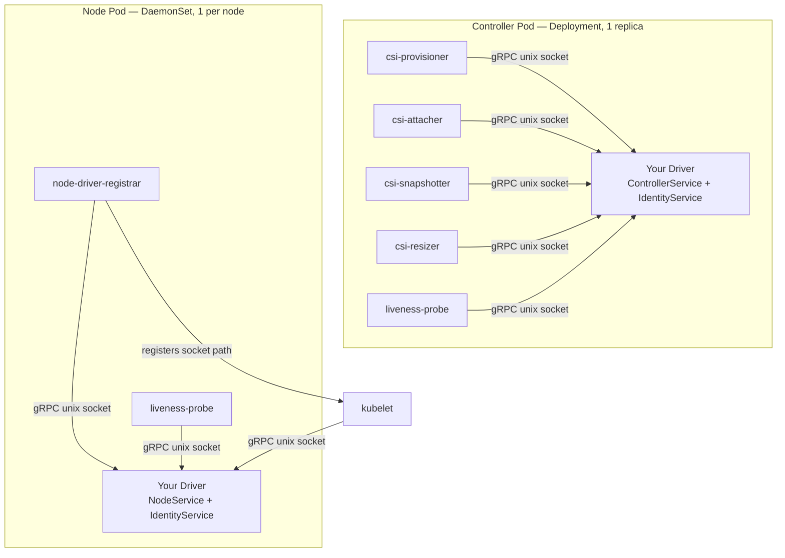
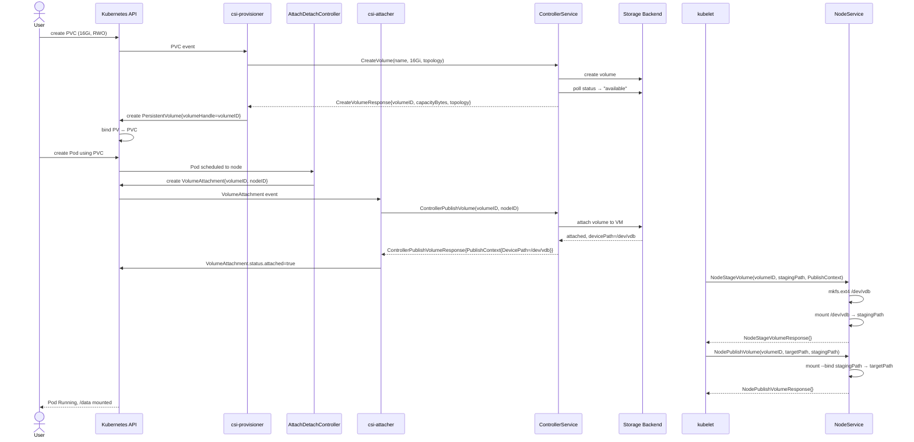
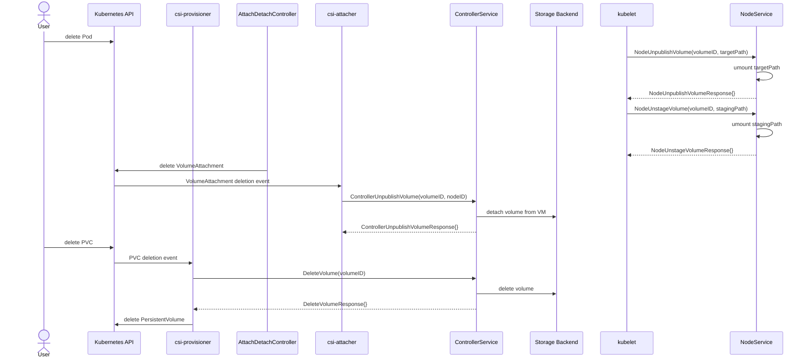
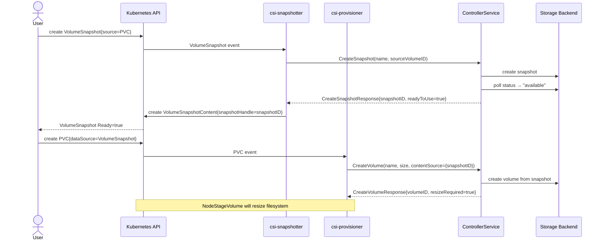
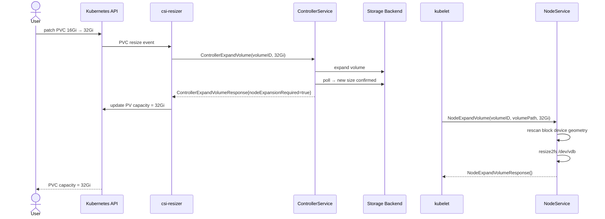
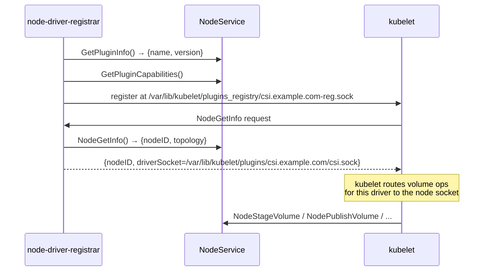

Kubernetes storage is one of those areas that looks simple from the outside — you create a `PersistentVolumeClaim`, a pod mounts it, done. But the moment you need to integrate your own storage backend, you're staring at the [Container Storage Interface spec](https://github.com/container-storage-interface/spec), sidecar containers you've never heard of, and gRPC services that have to be wired together just right.

I had the pleasure of writing and contributing to a production-grade CSI driver end-to-end. This post covers everything I wish I had in one place: what CSI actually is, how Kubernetes orchestrates it, and how to implement all three services in Go.

---

## What is CSI?

CSI (Container Storage Interface) is a standardized gRPC API between Kubernetes and storage providers. Before CSI existed, storage drivers were compiled directly into Kubernetes — adding a new one meant patching the Kubernetes tree.
 If you remember a few Kubernetes versions ago where your non-Azure Kubernetes is actually logging non-stop that Azure is not working? Yeah, that kind of problem due to coupling.

CSI moved drivers out-of-tree: your storage backend ships its own binary, Kubernetes talks to it over a Unix socket.

The spec defines three gRPC services:

- **IdentityService** — who are you, are you healthy?
- **ControllerService** — manage volumes at the infrastructure level (create, delete, attach, snapshot)
- **NodeService** — manage volumes on a specific node (format, mount, bind-mount into pods)

Your driver implements these. Kubernetes provides sidecar containers that translate Kubernetes events into the right RPC calls.

---

## Architecture Overview

Two separate binaries run in the cluster:



The controller pod runs centrally and manages volume lifecycle against your storage backend API. The node pod runs on every machine and handles the actual OS-level work: formatting disks, mounting filesystems, bind-mounting into pods.

They communicate via **Unix domain sockets**, not TCP. Each sidecar and the driver share an `emptyDir` (controller) or `hostPath` (node) volume where the socket lives.

---

## How Kubernetes Orchestrates CSI

The sidecars are the glue. You don't call your driver directly — the sidecars watch Kubernetes API resources and translate events into gRPC calls.

| Sidecar | Watches | Triggers RPC |
|---|---|---|
| `csi-provisioner` | PersistentVolumeClaim | `CreateVolume` / `DeleteVolume` |
| `csi-attacher` | VolumeAttachment | `ControllerPublishVolume` / `ControllerUnpublishVolume` |
| `csi-snapshotter` | VolumeSnapshot | `CreateSnapshot` / `DeleteSnapshot` |
| `csi-resizer` | PVC resize | `ControllerExpandVolume` |
| `node-driver-registrar` | startup | registers socket with kubelet |
| `kubelet` | Pod scheduling | `NodeStageVolume` / `NodePublishVolume` |

kubelet talks to the node plugin directly after `node-driver-registrar` registers the socket path at `/var/lib/kubelet/plugins_registry/`.

---

## The Full Volume Lifecycle

### Provision → Mount



Three distinct paths to understand here:

1. **Provision** (`csi-provisioner` → `CreateVolume`) — creates the volume in your backend, Kubernetes creates a PV.
2. **Attach** (`csi-attacher` → `ControllerPublishVolume`) — attaches the block device to the VM running the pod. Returns the device path (e.g. `/dev/vdb`) in `PublishContext`.
3. **Stage + Publish** (kubelet → `NodeStageVolume` + `NodePublishVolume`) — formats and mounts the device to a staging path, then bind-mounts that into the pod's specific target path.

The staging/publish split exists so multiple pods on the same node can share one formatted device via bind mounts, rather than formatting once per pod.

### Unmount → Delete



Exact reverse order: unpublish → unstage → detach → delete. Each step must succeed before the next begins.

### Snapshots



### Volume Expansion



---

## Implementing the Driver in Go

### Project Structure

```
cmd/
  controller/main.go    # wires ControllerService + IdentityService
  node/main.go          # wires NodeService + IdentityService
internal/
  server/server.go      # Unix socket listener + gRPC server
  driver/
    identity.go
    controller.go       # struct + capability declarations
    controller_volume.go
    controller_snapshot.go
    node.go
    mounter.go          # interface wrapping k8s.io/mount-utils
    metadata.go         # node instance ID + AZ
```

Two binaries, one shared `internal/driver` package. The controller binary registers `ControllerServer` + `IdentityServer`. The node binary registers `NodeServer` + `IdentityServer`.

### The gRPC Server

```go
func CreateListener(endpoint string) (net.Listener, error) {
    path := strings.TrimPrefix(endpoint, "unix://")
    _ = os.Remove(path)

    return net.Listen("unix", path)
}

func CreateGRPCServer(logger *slog.Logger) *grpc.Server {
    return grpc.NewServer(
        grpc.ChainUnaryInterceptor(requestLogger(logger)),
    )
}
```

```go
// cmd/controller/main.go — error handling omitted for brevity.
listener, _ := internal.CreateListener(cfg.CSIEndpoint)
grpcServer := internal.CreateGRPCServer(logger)
csiproto.RegisterControllerServer(grpcServer, controllerService)
csiproto.RegisterIdentityServer(grpcServer, identityService)
grpcServer.Serve(listener)
```

### IdentityService

The simplest service. Declares what the driver supports and responds to health checks.

```go
type IdentityService struct {
    csiproto.UnimplementedIdentityServer
    logger *slog.Logger
    ready  atomic.Bool
}

func (is *IdentityService) GetPluginInfo(_ context.Context, _ *csiproto.GetPluginInfoRequest) (*csiproto.GetPluginInfoResponse, error) {
    return &csiproto.GetPluginInfoResponse{
        Name:          "csi.example.com",
        VendorVersion: "1.0.0",
    }, nil
}

func (is *IdentityService) GetPluginCapabilities(_ context.Context, _ *csiproto.GetPluginCapabilitiesRequest) (*csiproto.GetPluginCapabilitiesResponse, error) {
    return &csiproto.GetPluginCapabilitiesResponse{
        Capabilities: []*csiproto.PluginCapability{
            {Type: &csiproto.PluginCapability_Service_{
                Service: &csiproto.PluginCapability_Service{
                    Type: csiproto.PluginCapability_Service_CONTROLLER_SERVICE,
                },
            }},
        },
    }, nil
}

func (is *IdentityService) Probe(_ context.Context, _ *csiproto.ProbeRequest) (*csiproto.ProbeResponse, error) {
    return &csiproto.ProbeResponse{
        Ready: &wrapperspb.BoolValue{Value: is.ready.Load()},
    }, nil
}
```

Call `is.SetReady(true)` after everything is wired up, just before `grpcServer.Serve`.

### ControllerService

The controller manages your storage backend. The struct holds clients to your backend APIs:

```go
type ControllerService struct {
    csiproto.UnimplementedControllerServer
    logger    *slog.Logger
    volClient VolumeAPIClient
    vmClient  VMAPIClient
    region    string
}
```

**CreateVolume** must be idempotent — `csi-provisioner` will retry. Check by name first:

```go
func (cs *ControllerService) CreateVolume(ctx context.Context, req *csiproto.CreateVolumeRequest) (*csiproto.CreateVolumeResponse, error) {
    if req.GetName() == "" {
        return nil, status.Error(codes.InvalidArgument, "missing name")
    }

    existing, err := cs.volClient.GetByName(ctx, req.GetName())
    if err == nil {
        return buildCreateResponse(existing), nil
    }


    sizeGB := bytesToGB(req.GetCapacityRange().GetRequiredBytes())

    vol, err := cs.volClient.Create(ctx, CreateVolumeParams{
        Name:             req.GetName(),
        SizeGB:           sizeGB,
        AvailabilityZone: azFromTopology(req.GetAccessibilityRequirements()),
    })
    if err != nil {
        return nil, status.Errorf(codes.Internal, "create volume failed: %v", err)
    }

    err = cs.waitForStatus(ctx, vol.ID, "available")
    if err != nil {
        return nil, status.Errorf(codes.Internal, "volume not ready: %v", err)
    }

    return buildCreateResponse(vol), nil
}
```

The exponential backoff wait is critical — most storage APIs are asynchronous:

```go
func (cs *ControllerService) waitForStatus(ctx context.Context, volumeID, target string) error {
    backoff := wait.Backoff{
        Duration: time.Second,
        Factor:   1.1,
        Steps:    15,
    }
    return wait.ExponentialBackoffWithContext(ctx, backoff, func(ctx context.Context) (bool, error) {
        vol, err := cs.volClient.Get(ctx, volumeID)
        if err != nil {
            return false, err
        }
        return vol.Status == target, nil
    })
}
```

**ControllerPublishVolume** attaches the block device to the VM. The key output is `PublishContext` — this is how the device path travels from the controller to the node:

```go
func (cs *ControllerService) ControllerPublishVolume(ctx context.Context, req *csiproto.ControllerPublishVolumeRequest) (*csiproto.ControllerPublishVolumeResponse, error) {
    volumeID := req.GetVolumeId()
    nodeID := req.GetNodeId()

    err = cs.vmClient.AttachVolume(ctx, nodeID, volumeID)
    if err != nil {
        return nil, status.Errorf(codes.Internal, "attach failed: %v", err)
    }

    err = cs.waitUntilAttached(ctx, nodeID, volumeID)
    if err != nil {
        return nil, status.Errorf(codes.Internal, "attach timeout: %v", err)
    }

    devicePath, err := cs.volClient.GetDevicePath(ctx, volumeID, nodeID)
    if err != nil {
        return nil, status.Errorf(codes.Internal, "device path: %v", err)
    }

    return &csiproto.ControllerPublishVolumeResponse{
        PublishContext: map[string]string{
            "DevicePath": devicePath,
        },
    }, nil
}
```

### NodeService

The node runs with elevated privileges on every machine. It receives the `PublishContext` from the controller and turns it into real mounts.

**NodeStageVolume** formats (if needed) and mounts to a shared staging path:

```go
func (ns *NodeService) NodeStageVolume(ctx context.Context, req *csiproto.NodeStageVolumeRequest) (*csiproto.NodeStageVolumeResponse, error) {
    stagingTarget := req.GetStagingTargetPath()
    devicePath := req.GetPublishContext()["DevicePath"]

    notMnt, err := ns.mounter.IsLikelyNotMountPointAttach(stagingTarget)
    if err != nil {
        return nil, status.Error(codes.Internal, err.Error())
    }

    if notMnt {
        fsType := "ext4"
        if mnt := req.GetVolumeCapability().GetMount(); mnt != nil && mnt.GetFsType() != "" {
            fsType = mnt.GetFsType()
        }

        err = ns.mounter.FormatAndMount(devicePath, stagingTarget, fsType, nil)
        if err != nil {
            return nil, status.Error(codes.Internal, err.Error())
        }
    }

    return &csiproto.NodeStageVolumeResponse{}, nil
}
```

**NodePublishVolume** bind-mounts the staging path into the pod's specific directory:

```go
func (ns *NodeService) NodePublishVolume(ctx context.Context, req *csiproto.NodePublishVolumeRequest) (*csiproto.NodePublishVolumeResponse, error) {
    targetPath := req.GetTargetPath()
    stagingPath := req.GetStagingTargetPath()

    mountOptions := []string{"bind"}
    if req.GetReadonly() {
        mountOptions = append(mountOptions, "ro")
    } else {
        mountOptions = append(mountOptions, "rw")
    }

    err := ns.mounter.Mount(stagingPath, targetPath, "ext4", mountOptions)
    if err != nil {
        return nil, status.Errorf(codes.Internal, "bind mount failed: %v", err)
    }


    return &csiproto.NodePublishVolumeResponse{}, nil
}
```

**NodeGetInfo** is called by kubelet at startup to learn the node's identity and topology. This is how `topology.kubernetes.io/zone` gets set:

```go
func (ns *NodeService) NodeGetInfo(ctx context.Context, _ *csiproto.NodeGetInfoRequest) (*csiproto.NodeGetInfoResponse, error) {
    instanceID, err := ns.metadata.GetInstanceID()
    if err != nil {
        return nil, status.Errorf(codes.Internal, "instance ID: %v", err)
    }

    zone, err := ns.metadata.GetAvailabilityZone()
    if err != nil {
        return nil, status.Errorf(codes.Internal, "availability zone: %v", err)
    }


    return &csiproto.NodeGetInfoResponse{
        NodeId: instanceID,
        AccessibleTopology: &csiproto.Topology{
            Segments: map[string]string{
                "topology.kubernetes.io/zone": zone,
            },
        },
    }, nil
}
```

### The Mounter Interface

Rather than calling `mount` directly, wrap `k8s.io/mount-utils`. This makes the node service testable with a fake mounter:

```go
type Mounter interface {
    FormatAndMount(source, target, fsType string, options []string) error
    Mount(source, target, fsType string, options []string) error
    UnmountPath(mountPath string) error
    IsLikelyNotMountPointAttach(path string) (bool, error)
    GetDevicePath(ctx context.Context, volumeID string) (string, error)
    Execer() exec.Interface
}
```

```go
func NewMounter() Mounter {
    return &mounter{
        BaseMounter: mountutil.New(""),
        exec:        exec.New(),
    }
}
```

---

## Deployment

### Controller Deployment

```yaml
apiVersion: apps/v1
kind: Deployment
metadata:
  name: csi-controller
spec:
  replicas: 1
  template:
    spec:
      containers:
      - name: csi-provisioner
        image: registry.k8s.io/sig-storage/csi-provisioner:v5.2.0
        args: ["--csi-address=/csi/csi.sock", "--leader-election"]
        volumeMounts:
        - name: socket-dir
          mountPath: /csi

      - name: csi-attacher
        image: registry.k8s.io/sig-storage/csi-attacher:v4.8.0
        args: ["--csi-address=/csi/csi.sock", "--leader-election"]
        volumeMounts:
        - name: socket-dir
          mountPath: /csi

      - name: csi-driver
        image: your-registry/csi-controller:latest
        env:
        - name: CSI_ENDPOINT
          value: unix:///csi/csi.sock
        volumeMounts:
        - name: socket-dir
          mountPath: /csi

      volumes:
      - name: socket-dir
        emptyDir: {}  # shared between all sidecars in this pod
```

### Node DaemonSet

```yaml
apiVersion: apps/v1
kind: DaemonSet
metadata:
  name: csi-node
spec:
  template:
    spec:
      containers:
      - name: node-driver-registrar
        image: registry.k8s.io/sig-storage/csi-node-driver-registrar:v2.13.0
        args:
        - --csi-address=/csi/csi.sock
        - --kubelet-registration-path=/var/lib/kubelet/plugins/csi.example.com/csi.sock
        volumeMounts:
        - name: socket-dir
          mountPath: /csi
        - name: registration-dir
          mountPath: /registration

      - name: csi-driver
        image: your-registry/csi-node:latest
        securityContext:
          privileged: true
          capabilities:
            add: ["SYS_ADMIN"]
        env:
        - name: CSI_ENDPOINT
          value: unix:///csi/csi.sock
        volumeMounts:
        - name: socket-dir
          mountPath: /csi
        - name: kubelet-dir
          mountPath: /var/lib/kubelet
          mountPropagation: Bidirectional  # essential: propagates mounts to host
        - name: dev-dir
          mountPath: /dev

      volumes:
      - name: socket-dir
        hostPath:
          path: /var/lib/kubelet/plugins/csi.example.com/
          type: DirectoryOrCreate
      - name: registration-dir
        hostPath:
          path: /var/lib/kubelet/plugins_registry/
      - name: kubelet-dir
        hostPath:
          path: /var/lib/kubelet
      - name: dev-dir
        hostPath:
          path: /dev
```

Two things that catch people out:

1. **`mountPropagation: Bidirectional`** on the kubelet dir — without this, mounts made inside the node container aren't visible to the host, so the pod never sees the volume.
2. **`privileged: true`** — the node driver calls `mount(2)`, which requires root. There's no way around it.

---

## Error Handling and Idempotency

The CSI spec requires every RPC to be idempotent. Kubernetes retries. You will receive `CreateVolume` twice with the same name. You will receive `ControllerPublishVolume` for an already-attached volume. Handle this by checking state before acting:

```go
// CreateVolume — return existing volume if found by name.
existing, err := cs.volClient.GetByName(ctx, name)
if err == nil {
    return buildCreateResponse(existing), nil
}

// ControllerPublishVolume — skip attach if already attached.
if attached, _ := cs.isAttached(ctx, nodeID, volumeID); attached {
    devicePath, _ := cs.getDevicePath(ctx, volumeID, nodeID)
    return &csiproto.ControllerPublishVolumeResponse{
        PublishContext: map[string]string{"DevicePath": devicePath},
    }, nil
}
```

Use gRPC status codes correctly:

```go
codes.InvalidArgument  // caller's fault, missing/bad input
codes.NotFound         // resource doesn't exist
codes.AlreadyExists    // for CreateVolume when name conflicts with different params
codes.Internal         // backend/driver error
codes.Unavailable      // transient, safe to retry
```

---

## Node Registration Sequence



---

## Common Pitfalls

**Volume size rounding.** Many backends work in GiB, not bytes. `req.GetCapacityRange().GetRequiredBytes()` is in bytes. Convert carefully and round up, not down — returning a smaller volume than requested violates the spec.

**`NodeStageVolume` vs `NodePublishVolume`.** Stage runs once per volume per node. Publish runs once per pod. If you skip staging and try to format in publish, two pods requesting the same volume will race to run `mkfs` on the same device.

**Blocking RPCs.** All CSI RPCs are synchronous from the caller's perspective, but backends are async. `CreateVolume` must not return until the volume is usable. Poll with backoff; don't sleep for a fixed duration.

**xfs and duplicate UUIDs.** If you restore a snapshot to create a new volume, the new volume has the same filesystem UUID as the original. xfs refuses to mount two volumes with the same UUID on the same node. Pass `nouuid` as a mount option for xfs volumes:

```go
if fsType == "xfs" {
    options = append(options, "nouuid")
}
```

**Block volumes.** If you support `VolumeCapability_AccessMode_SINGLE_NODE_WRITER` for raw block, `NodePublishVolume` needs a different code path — create a file at `targetPath` and bind-mount the device file, not a directory.

---

## Testing

Unit test the controller and node services with mock backends and a fake mounter:

```go
func TestCreateVolume_Idempotent(t *testing.T) {
    ctrl := NewControllerService(fakeVolClient, fakeVMClient, ...)

    req := &csiproto.CreateVolumeRequest{
        Name:             "test-vol",
        CapacityRange:    &csiproto.CapacityRange{RequiredBytes: 16 * 1024 * 1024 * 1024},
        VolumeCapabilities: defaultCaps(),
    }

    resp1, err := ctrl.CreateVolume(ctx, req)
    require.NoError(t, err)

    resp2, err := ctrl.CreateVolume(ctx, req)
    require.NoError(t, err)

    assert.Equal(t, resp1.GetVolume().GetVolumeId(), resp2.GetVolume().GetVolumeId())
}
```

For the node service, `k8s.io/mount-utils` ships a `FakeMounter` that records mount calls without touching the filesystem — use it.

Integration testing the full flow requires a real Kubernetes cluster. The [Kubernetes CSI sanity test suite](https://github.com/kubernetes-csi/csi-test) provides a standard set of conformance tests you can run against a live driver socket.

---

## What You End Up With

After all of this, what you have is:

- A controller binary that speaks to your storage API and manages volume/snapshot lifecycle
- A node binary that runs on every node, formats disks, and manages mounts
- Two Kubernetes workloads (Deployment + DaemonSet) with the right sidecar containers
- StorageClass, RBAC, and a driver registration object pointing at your plugin name

The CSI spec is verbose but consistent. Once you've implemented `CreateVolume` and `NodeStageVolume`, the pattern repeats. The hard parts are operational: idempotency under retries, async backend polling, and getting mount propagation right in the DaemonSet.

The [official CSI spec](https://github.com/container-storage-interface/spec/blob/master/spec.md) and the [kubernetes-csi examples repo](https://github.com/kubernetes-csi/csi-driver-host-path) are the two references worth keeping open while building. Note, even though the examples repo says this is not a good example, it's actually a decent start to get the boilerplate and setup right.
