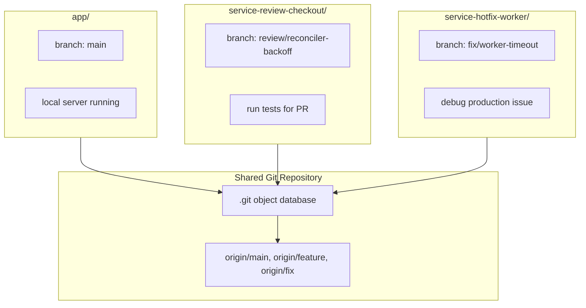
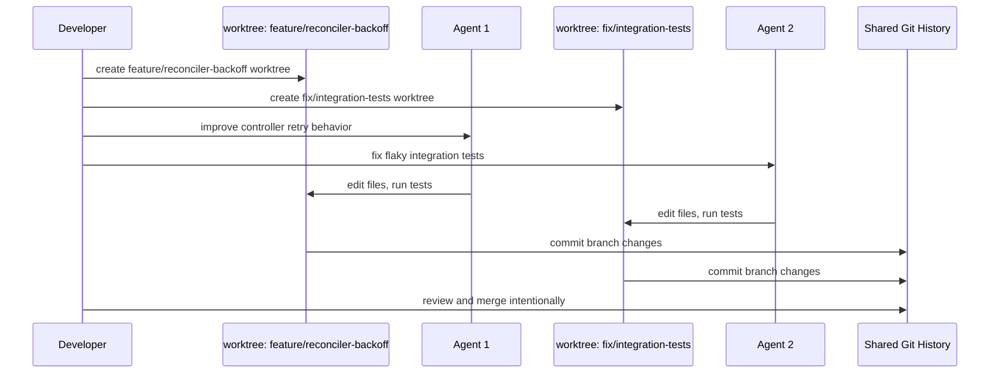

It's 2026, and everyone is claiming to run parallel agents through one harness or another: Claude Code, Cursor, Aider, and whatnot.

Still, I think we need to understand how these tools work underneath, and even use the same primitives ourselves in the old and boring way: manually.

That was my experience with Git worktrees. I knew about them for more than 10 years, but only started using them seriously last year.

The goal of this post is to share my experience with Git worktrees from a developer perspective: how they help in normal day-to-day work, how AI agents use them, what CLI tools are available, and where it makes sense to use `git worktree` instead of something like `git bisect`, which is what I used to reach for first. You can read the official Linux `man` page-style documentation too, but this post is usage-centered, not a CLI reference.

That changes when local state starts to matter. You have a server running, generated files, uncommitted debugging changes, a database migration half-tested, and three editor tabs open in the middle of a problem. Then someone asks you to review a PR, or a production bug appears, or you want to run an AI coding agent on a separate task.

This is the point where branch switching stops being cheap.

Worktrees solve the problem at the right layer: one repository, multiple working directories, each on its own branch. No duplicate clone, no shared working directory, no stash dance.

---

## What is a Git Worktree?

A [Git worktree](https://git-scm.com/docs/git-worktree) lets you check out more than one branch from the same repository at the same time. Each branch gets its own directory. All of them share the same underlying Git object database.

The mental model is simple:

```text
repo/
  main branch

repo-review-reconciler/
  review/reconciler-backoff branch

repo-hotfix-worker/
  fix/worker-timeout branch
```

Instead of changing the branch inside one directory, you change directories.

Git added worktrees in Git 2.5, released in 2015. This is not a new experimental feature. It has been sitting there quietly for almost a decade, mostly used by people who got tired of stashing at exactly the wrong time or running `git bisect` to oblivion to catch issues.

The important rule:

**One branch can only be checked out in one worktree at a time.**

Git will not let you check out the same branch in two directories simultaneously. That is a feature, not a limitation. It prevents two working directories from trying to mutate the same branch state.

---

## Architecture Overview

A normal clone gives you one working directory attached to one checked-out branch. A repository with worktrees gives you many working directories attached to the same Git history.



The directories are independent at the filesystem level. They can have different build artifacts, different uncommitted changes, different running processes, and different editor windows.

The history is still shared. Fetch once, push normally, merge normally.

---

## Basic Commands

Native Git has everything you need. The full command reference is in the [`git worktree` documentation](https://git-scm.com/docs/git-worktree):

```bash
# Create a worktree for an existing branch
git worktree add ../service-reconciler feature/reconciler-backoff

# Create a new branch and a worktree for it
git worktree add -b fix/worker-timeout ../service-fix-worker-timeout main

# Create a worktree from a remote branch
git fetch origin
git worktree add ../service-review-migrations origin/review/migration-locking

# List active worktrees
git worktree list

# Remove a worktree after you are done
git worktree remove ../service-review-migrations

# Clean up stale metadata if a directory was removed manually
git worktree prune
```

There is no magic beyond that. Each worktree is just another directory. You can `cd` into it, open it in your editor, run tests, start a dev server, or hand it to an agent.

The related Git commands worth knowing are [`git fetch`](https://git-scm.com/docs/git-fetch), [`git branch`](https://git-scm.com/docs/git-branch), and [`git status`](https://git-scm.com/docs/git-status). Worktrees do not replace those commands; they give each branch a separate working directory.

---

## Why Worktrees Matter for Developers

The classic worktree example is the urgent hotfix. You are halfway through a feature and production breaks. Without worktrees, you either stash your changes, commit something unfinished, or clone the repository again somewhere else.

With worktrees:

```bash
git worktree add -b fix/worker-timeout ../service-fix-worker-timeout main
cd ../service-fix-worker-timeout
```

Your feature branch stays exactly where it was. Your editor, running server, generated files, and local debugging state do not move. The hotfix gets a clean directory from `main`.

That is useful even if you never touch AI tools.

### Reviewing a PR locally

Some reviews can be done from a diff. Some cannot. If the change touches build tooling, database migrations, generated clients, controller logic, or anything with runtime behavior, you usually need to run it.

```bash
git fetch origin
git worktree add ../service-review-migration-locking origin/pr/migration-locking
cd ../service-review-migration-locking

go test ./...
make integration-test
go run ./cmd/api --listen :8081
```

Your own branch keeps running in the original directory. The review has a clean checkout and its own dependency state. When the review is done:

```bash
cd ../service
git worktree remove ../service-review-migration-locking
```

No branch switching. No cleanup from someone else's generated files. No accidental commit of review-only changes into your feature branch.

### Comparing two branches side by side

Sometimes the diff is not enough. You want to run the old behavior and the new behavior at the same time.

```bash
git worktree add ../service-before-release release/2026-04
git worktree add ../service-after-release main
```

Now you can start both versions on different ports:

```bash
# service-before-release
go run ./cmd/api --listen :8080

# service-after-release
go run ./cmd/api --listen :8081
```

This is especially useful for API behavior changes, migration behavior, queue processing, controller reconciliation, and performance comparisons. You can keep both branches running, send the same request or replay the same message, and see what actually changed.

### Debugging two related repositories

Worktrees become even more useful when the bug crosses repository boundaries. A common backend example is a service and the Go client, protobuf definitions, or shared platform library it depends on.

```text
service/
  main branch

service-debug-search-timeout/
  fix/search-timeout branch

client-go/
  main branch

client-go-debug-search-timeout/
  fix/search-timeout-context branch
```

You can run the service fix in one worktree and the client or shared library fix in another:

```bash
# Service repository
cd ~/src/service
git worktree add -b fix/search-timeout ../service-debug-search-timeout main

# Go client repository
cd ~/src/client-go
git worktree add -b fix/search-timeout-context ../client-go-debug-search-timeout main
```

Now the debugging environment is explicit:

```text
service-debug-search-timeout       -> service on :8080
client-go-debug-search-timeout     -> client tests against :8080
service and client-go main dirs    -> untouched
```

If the investigation goes nowhere, delete both worktrees. If it works, keep the branches and open two PRs. Your normal development setup remains intact.

---

## Git Bisect vs Worktrees

[`git bisect`](https://git-scm.com/docs/git-bisect) and `git worktree` solve different debugging problems.

`git bisect` is for finding the commit that introduced a regression. You give Git one known-good commit and one known-bad commit, then Git checks out commits in the middle until the bad commit is isolated.

```bash
git bisect start
git bisect bad HEAD
git bisect good v1.42.0

# Run your test at each step
go test ./internal/search -run TestSearchTimeout

git bisect good
# or
git bisect bad

git bisect reset
```

Use `git bisect` when the question is:

**Which commit broke this?**

Use worktrees when the question is:

**How do I investigate this without destroying my current working state?**

The two tools also work well together. If you are in the middle of feature work and need to bisect a production regression, create a clean worktree and run the bisect there:

```bash
git worktree add ../service-bisect main
cd ../service-bisect

git bisect start
git bisect bad HEAD
git bisect good v1.42.0
```

That keeps the bisect checkout churn away from your main development directory. This matters because `git bisect` repeatedly checks out different commits. If your service needs generated protobuf clients, local config, migrations, test containers, or a running dependency, doing that in your main checkout is painful.

A simple rule:

1. Use **worktrees** when you need multiple working directories at the same time.
2. Use **bisect** when you need Git to search history for the first bad commit.
3. Use **bisect inside a worktree** when you need to debug history without interrupting current work.

For quick regressions with a reliable test command, `git bisect` is usually easier. For messy investigations where you need to compare branches, keep servers running, inspect a PR, or preserve local state, worktrees are easier. For serious production debugging, I usually start with a worktree so the investigation has its own clean room, then use bisect inside it if I need the exact breaking commit.

---

## When to Use Worktrees

Use a worktree when the cost of switching branches is higher than the cost of creating another directory.

Good use cases:

1. You are in the middle of feature work and need to handle an urgent bug.
2. You need to review a PR locally without disturbing your current branch.
3. You want to compare two branches by running both at the same time.
4. You are testing a dependency upgrade and expect generated files or lockfile churn.
5. You are debugging behavior across two services or two repositories.
6. You want to run `git bisect` without disturbing your current checkout.
7. You want to give an AI coding agent its own isolated workspace.
8. You need a clean release branch checkout while continuing work on `main`.

You probably do not need a worktree for a two-minute edit, a simple documentation change, or a branch you will check out once and immediately merge. Normal branch switching is still fine when local state does not matter.

The signal is friction. If you are about to stash, stop a server, save a half-written note, or worry about generated files, a worktree is probably cleaner.

---

## Why Worktrees Matter for AI Agents

An AI coding agent is just another writer in your working directory. If you run one agent in your main checkout, everything is fine. One branch, one filesystem, one stream of changes.

The moment you run two agents against the same directory, the model breaks.

They can edit the same file. They can race on `go.mod`, generated protobuf code, migrations, or OpenAPI clients. One agent can run formatting while another is reading stale state. They can overwrite each other's generated files. Even if the agents are careful, the working directory is not designed for concurrent mutation.

Worktrees give each agent a separate branch and a separate filesystem:



That gives you the right failure boundary. If one agent goes in the wrong direction, delete that worktree. If another produces something useful, review the branch and merge it.

The review step is still human. The isolation lets you parallelize the execution without pretending that all generated code is automatically correct.

---

## The Agent Workflow

The simplest version uses native Git:

```bash
git worktree add -b agent/reconciler-backoff ../service-agent-reconciler main
git worktree add -b agent/storage-timeout ../service-agent-storage main
git worktree add -b agent/fix-integration-tests ../service-agent-tests main
```

Then run one agent per directory:

```bash
cd ../service-agent-reconciler
claude "Add exponential backoff to the controller reconcile loop and cover it with tests"

cd ../service-agent-storage
cursor-agent "Investigate object storage timeout handling and make retries idempotent"

cd ../service-agent-tests
codex "Fix the flaky integration tests around postgres advisory locks"
```

The exact tool does not matter. Cursor, Claude Code, Codex, or any local agent benefits from the same isolation model.

After the agents finish, review like any other branch:

```bash
cd ../service-agent-reconciler
git status
git diff main...HEAD
go test ./...
```

Then merge, cherry-pick, or throw it away.

---

## Using Worktrunk

Native commands work, but the lifecycle has friction. You create a branch, create a directory, switch into it, run setup commands, maybe copy `.env`, maybe install dependencies, then later merge and clean up.

[Worktrunk](https://worktrunk.dev) (`wt`) wraps that flow:

```bash
brew install max-sixty/tap/worktrunk
# or
cargo install worktrunk
```

Add shell integration so `wt switch` can actually change your directory:

```bash
# .zshrc
eval "$(wt shell-init zsh)"
```

The core workflow becomes:

```bash
# Create a new branch and worktree, then cd into it
wt switch --create feature-reconciler-backoff

# See worktrees with status
wt list

# Merge back to main
wt merge main

# Remove the worktree and branch
wt remove
```

Worktrunk can also launch a command directly inside the new worktree:

```bash
wt switch -x claude -c feature-reconciler-backoff -- "Add exponential backoff to the controller reconcile loop"
```

The useful part is not just shorter syntax. It is lifecycle management. A good worktree workflow needs hooks for local setup:

```toml
# .wt.toml
[hooks]
post_create = [
  "cp ../service/.env .env",
  "go mod download",
  "make generate"
]
```

That is where worktrees become comfortable. New branch, clean directory, local setup done, agent or developer starts working.

---

## Tooling Around Worktrees

There is a small but growing ecosystem around this because the primitive is simple and the workflows around it are repetitive.

| Tool                                                                 | Type         | Best for                                                  |
| -------------------------------------------------------------------- | ------------ | --------------------------------------------------------- |
| [**Worktrunk** (`wt`)](https://github.com/max-sixty/worktrunk)        | CLI          | Lifecycle management, hooks, agent launching, scripting   |
| [**git-worktree-runner** (`gtr`)](https://github.com/coderabbitai/git-worktree-runner) | CLI          | Editor integration, CodeRabbit workflows, AI tool support |
| [**Claude Squad**](https://github.com/smtg-ai/claude-squad)          | tmux wrapper | Keyboard-first users who want multiple agents in tmux     |
| [**Daintree**](https://github.com/daintreehq/daintree)               | Desktop app  | Visibility into agent state across worktrees              |
| [**Superset**](https://github.com/superset-sh/superset)              | IDE          | Full multi-agent orchestration with a dashboard           |
| [**gwq**](https://github.com/d-kuro/gwq)                             | CLI          | Lightweight status dashboard with tmux integration        |

My default is still a terminal-first workflow, complimented with more and more usage of `wt`. So, to understand what these CLI tools abstract away, start with native `git worktree` for a few days. If you find yourself repeating setup and cleanup steps, add `wt`. If you are running enough agents that you no longer know which one is waiting for input, add a visibility layer.

Cursor and Claude Code also have first-class worktree now. That is the important shift: the old Git feature became a normal part of the AI coding toolchain.

---

## Common Pitfalls

**Trying to check out the same branch twice.** Git prevents this. Create a new branch per worktree, even if it is temporary.

```bash
git worktree add -b review/migration-locking ../service-review-migration-locking origin/migration-locking
```

**Deleting the directory manually.** If you remove a worktree with `rm -rf`, Git may still keep metadata for it. Prefer:

```bash
git worktree remove ../service-review-migration-locking
```

If the directory is already gone:

```bash
git worktree prune
```

**Forgetting local setup.** A worktree does not automatically have your copied `.env`, downloaded modules, generated clients, local database state, or running services. Automate that setup if you create worktrees often.

**Sharing ports between worktrees.** Two copies of the same service cannot both bind to `localhost:8080`. Run them on different ports when comparing branches.

**Letting worktrees pile up.** Worktrees are cheap, but not free. List them regularly:

```bash
git worktree list
```

Remove the branches you no longer need.

**Treating agent output as merged work.** A worktree is isolation, not validation. You still need to read the diff, run tests, check generated files, and decide whether the change belongs in the main branch.

---

## What You End Up With

After adopting worktrees, what you have is:

- A stable main development directory that does not get interrupted by every review or hotfix
- Clean checkouts for PR reviews and release branches
- A practical way to compare two versions of the same service side by side
- Isolated directories for debugging multi-repo problems
- A safe filesystem boundary for running multiple AI agents in parallel

The feature itself is small. The workflow change is not. You stop treating the working directory as the only place work can happen.

For developers, that means fewer stashes, cleaner reviews, and less context loss. For AI agents, it means parallel work without pretending one mutable directory can safely host multiple writers.

Start with [`git worktree add`](https://git-scm.com/docs/git-worktree#Documentation/git-worktree.txt-add). Use it for your next local PR review or urgent bugfix. Once the pattern sticks, add tooling around the lifecycle.
