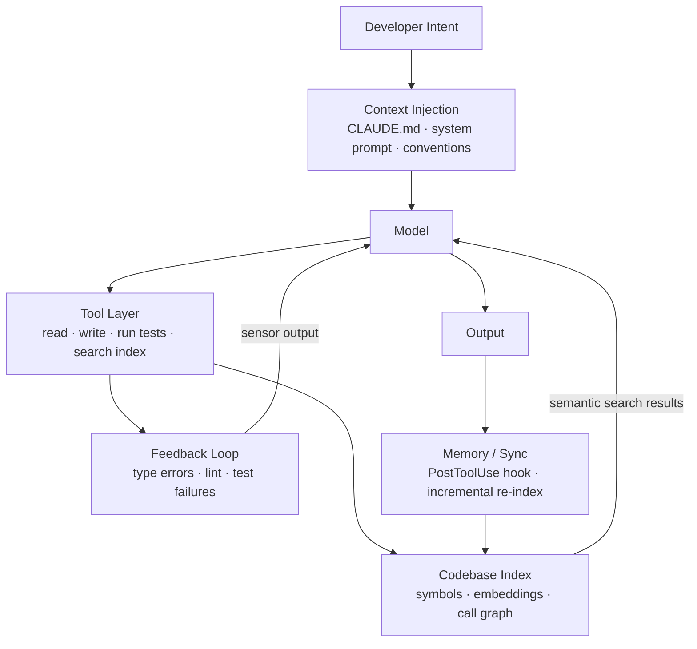
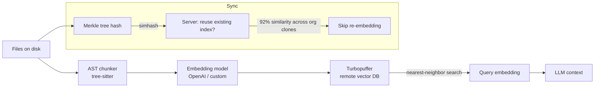
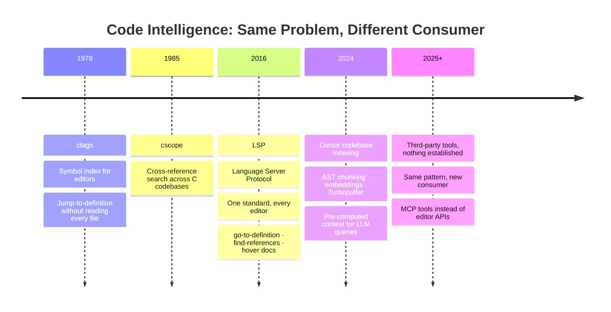

## What Is a Coding Harness?

**Agent = Model + Harness**. The model is the reasoning engine. The harness is everything else — the guides that steer it before it acts, the sensors that catch it after it does. ([Harness Engineering](https://martinfowler.com/articles/harness-engineering.html)).

In practice a coding harness has several moving parts:

- **Context injection** — what the agent knows before it writes a line. CLAUDE.md files, system prompts, project conventions.
- **Codebase indexing** — a queryable map of the repo. Symbols, call graphs, semantic embeddings.
- **Tool layer** — what the agent can *do*. Read files, run tests, call linters, search the index.
- **Feedback loop** — sensors that observe output quality. Type errors, failing tests, lint violations, architecture drift.
- **Memory / sync** — persistence across sessions. Hooks that re-index on session start, sync on file write.



The vocabulary here is not new. Russell & Norvig’s *AI: A Modern Approach* (1995) defined an agent as anything that perceives its environment through **sensors** and acts upon it through **actuators**. Chip Huyen applies this directly to modern LLM agents in [Agents](https://huyenchip.com/2025/01/07/agents.html) (2025): the model is the brain, tools are the actuators, observations are the sensors. Böckeler maps the same structure onto coding harnesses — guides are actuators (steer behavior forward), sensors are feedback mechanisms (observe what came out).

The naming changed. The pattern did not.

Most developers using Claude Code today have the tool layer (built-in) and partial context injection (CLAUDE.md). Almost nobody has the indexing layer wired up. That gap is where the performance falls off a cliff.

---

## Claude Code: Hooks and Harness Points

Claude Code exposes four hook events:

| Hook | Fires when | Harness use |
|---|---|---|
| `SessionStart` | Agent session begins | Re-index codebase, load project state |
| `PreToolUse` | Before any tool call | Gate dangerous ops, inject context |
| `PostToolUse` | After Write/Edit | Sync modified file back to index |
| `Stop` | Agent finishes | Run validators, emit summaries |

These hooks are the harness attachment points. A `SessionStart` hook that runs incremental re-indexing means the agent starts every session with a fresh semantic map of the codebase. A `PostToolUse` hook on Write/Edit means the index never drifts more than one file behind reality.

Without these wired up, the agent is flying blind every session. It compensates by grepping. A lot.

Hooks also solve a problem that surfaces when running parallel workstreams with [git worktrees](https://syndbg.github.io/posts/2026-05-02-git-worktrees-parallel-development-without-cloning-everything-twice/). Each worktree is an isolated working directory — useful for running two agent sessions on different branches simultaneously without conflicts. But secrets and environment files (`.env`, credentials, tokens) do not copy across automatically. A `SessionStart` hook scoped to the worktree can detect the working directory, locate the canonical secrets from a shared location, and symlink or inject them without duplicating sensitive files across every checkout. The harness manages the plumbing so neither the developer nor the agent has to think about it.

E.g

```bash
#!/usr/bin/env bash
# .claude/hooks/session-start.sh
# Symlink .env from the main worktree into the current worktree on session start.

MAIN_WORKTREE=$(git worktree list --porcelain | awk 'NR==1{print $2}')
CURRENT_DIR=$(pwd)

if [ "$CURRENT_DIR" != "$MAIN_WORKTREE" ] && [ -f "$MAIN_WORKTREE/.env" ]; then
  ln -sf "$MAIN_WORKTREE/.env" "$CURRENT_DIR/.env"
  echo "Linked .env from $MAIN_WORKTREE"
fi
```

Wire it in `.claude/settings.json`:

```json
{
  "hooks": {
    "SessionStart": [
      {
        "matcher": "",
        "hooks": [
          {
            "type": "command",
            "command": "bash .claude/hooks/session-start.sh"
          }
        ]
      }
    ]
  }
}
```

Runs once per session. If the working directory is a worktree (not main checkout), symlinks `.env` from main. No copies, no stale secrets, no manual setup per branch.

Or, you can use Claude code with `--worktree` which also invokes the `WorktreeCreate` hook, 
as per the example in [Claude's docs](https://code.claude.com/docs/en/hooks#worktreecreate).

---

## Cursor: Where Codebase Indexing Comes Built-In

Cursor does not make you wire this up yourself. It ships with persistent, background codebase indexing as a first-class feature. On session open, it already knows your symbols, your imports, your function signatures. Retrieval is a lookup, not an exploration.

This creates a felt difference in terms of accuracy, speed and cost-efficiency. Cursor doesn't, based on my experience, significantly regress to greping and bisecting for repetitive work. This cuts token usage quite significantly.

How Cursor's indexing pipeline ([docs](https://cursor.com/blog/secure-codebase-indexing)) works:



*Cursor indexes without storing filenames or source code — filenames are obfuscated, chunks are encrypted. Content proofs verify the client holds the file before results are returned.*

Median time-to-first-query for large repos dropped from **7.87s → 525ms** after Merkle-based index reuse shipped. ([Cursor: Secure Codebase Indexing](https://cursor.com/blog/secure-codebase-indexing)) (note: for some reason the link only redirects to the CN article, not the English one.)

The vector store behind this is [Turbopuffer](https://turbopuffer.com/customers/cursor). Cursor runs one namespace per codebase — active ones stay hot in memory/NVMe, inactive ones spill to object storage. At scale: **1T+ documents across 80M+ namespaces**, 10GB/s peak ingestion. Cold namespaces resume without re-embedding via `copy_from_namespace`, which is how the 92% org-clone similarity translates into actual latency savings rather than just a stat. Cursor moved to Turbopuffer in November 2023 and cut semantic search costs by 20x. Agent accuracy improved up to **23.5%** after the switch.

From [entire.io's analysis](https://entire.io/blog/improving-agentic-search-in-coding-agents): nearly **49% of all agent tool calls are search operations**. That is the exploration tax — paid in latency and tokens on every task that Cursor's index would answer instantly.


*Agent tool call breakdown. Nearly half of all calls are search. Source: [entire.io — Improving Agentic Search in Coding Agents](https://entire.io/blog/improving-agentic-search-in-coding-agents)*


*Tool execution is only 0.4% of wall-clock time. The bottleneck is model inference and planning, not search speed. Source: [entire.io — Improving Agentic Search in Coding Agents](https://entire.io/blog/improving-agentic-search-in-coding-agents)*

Last but not least, Claude Code on the other hand has the more pluggable system, but completely lacks in this department, resorting to third-party tools we'll see in a bit.

---

## We Have Done This Before

Here is the part that should sting: none of this is new.

**ctags** (1978) built symbol indexes so editors could jump to definitions without reading every file. 
**cscope** (1985) did cross-reference search across C codebases. 
**Language servers** (LSP, 2016) gave every editor a real-time semantic model of the code — go-to-definition, find-references, hover docs — without re-parsing anything.

The entire Language Server Protocol exists because editors kept re-implementing the same code intelligence in isolation. Microsoft proposed a standard. The ecosystem converged. Problem solved for the editor layer.

Now in 2026 we are building the same thing again for AI agents. Semantic codebase indexes. Symbol-aware chunking. Incremental sync. The concepts are identical. The target consumer changed from "editor plugin" to "LLM tool call."

We are not solving a new problem. We are re-plumbing an old one.



---

## Tools That Already Exist

Here are some of the tools I've tried over the last few months.


### [ory/lumen](https://github.com/ory/lumen)

Lumen is the closest thing the ecosystem has to a production-grade answer for Claude Code indexing. Single static binary, no Docker, no Python environment to manage. Install as a Claude Code plugin:

```bash
/plugin install lumen@ory
```

**What it does well:**

- AST-aware chunking via tree-sitter — splits at function boundaries, not arbitrary character windows. A retrieved chunk is a complete function, not lines 47–89 of one.
- Code-optimized embeddings: `jina-embeddings-v2-base-code` (512-dim), trained on code rather than general text.
- SQLite-vec as the vector store — embedded, zero infrastructure, single file on disk.
- `SessionStart` hook auto-wired on install. Index is fresh at the start of every session.
- Benchmarked: **26–39% token cost reduction**, **28–53% faster sessions** vs. baseline Claude Code.

In practice, indexing a medium Go service (220 files) takes ~9 minutes. A large polyglot monorepo (6,000+ files) can run for hours — and if you interrupt it, that nested repo logs zero chunks:

```
$ lumen index .
 INFO  Indexing nested repo /work/common-packages
Embedded 36 chunks so far [12/12] ████████████████████████████████████████ 100%
Indexing complete: 12 files, 36 chunks in 10.453s.
 INFO  Indexing nested repo /work/project-a
Embedded 2178 chunks so far [220/220] ████████████████████████████████████ 100%
Indexing complete: 220 files, 2178 chunks in 9m9.039s.
 INFO  Indexing nested repo /work/platform-repo
Processing file 368/6375: environments/development/... [0367/6375]    6%
Processing file 1601/6375: environments/production/... [1600/6375]   25%
Processing file 3298/6375: environments/production/.../... [3297/6375]   52% ^C
Nested repo /work/platform-repo: 0 files, 0 chunks in 3h15m16.412s.
 INFO  Indexing nested repo /work/project-b
Indexing complete: 176 files, 2168 chunks in 9m17.342s.
```

Overall, I'll be running this for hours and I am, when I want to capture the full scope.

**Where it struggles:**

SQLite-vec works well for a single focused codebase. For local, single-machine use it is a reasonable embedded choice — zero infrastructure, single file. But the HNSW implementation it provides is a single-node, in-process index. No concurrent writers, no on-disk persistence separate from the SQLite file, no incremental segment merges.

Dedicated vector stores built around HNSW — purpose-built for the algorithm — handle graph construction and search on separate threads, persist the graph independently from the payload store, and support filtered search without degrading ANN recall. SQLite-vec serialises everything through SQLite's WAL. At small scale the difference is invisible. Across a large monorepo (thousands of files, millions of chunks), query latency climbs.

**The macOS MCP server is currently broken.**

[Issue #136](https://github.com/ory/lumen/issues/136) and [Issue #152](https://github.com/ory/lumen/issues/152) document the same failure: after installing, the MCP server does not connect on macOS. The root cause is a POSIX shebang detection problem — `posix_spawn` requires bytes 0–1 to be `#!`, but a previous PR removed the shebang from `scripts/run.cmd` to fix Windows `cmd.exe` stdout cleanliness. The two constraints are mutually exclusive in a polyglot file.

[PR #154](https://github.com/ory/lumen/pull/154) (open at time of writing) fixes this by routing Claude Code and Cursor through a Node.js dispatcher (`run.cjs`) that invokes `run.sh` on Unix and `run.bat` on Windows. Until that merges, the workaround from issue #152 applies: edit `plugin.json` to point `command` at `scripts/run.sh` instead of `scripts/run.cmd`.

Lumen is the right direction. It is not stable enough yet for teams that cannot tolerate manual workarounds on install.

---

### [ruvnet/ruflo](https://github.com/ruvnet/ruflo)

Ruflo takes the opposite approach. Where Lumen is a focused indexing tool, Ruflo is an entire orchestration platform: 100+ specialized agents, multi-agent swarms, federation with mTLS, a built-in vector database (AgentDB with HNSW), 27 hooks, cost tracking, PII detection, and support for five LLM providers.

On paper, it solves everything at once. In practice, that is the problem.

Ruflo suffers from the same pattern this article argues against: instead of composing small, well-understood tools, it builds a new layer on top of everything. The HNSW-backed AgentDB is faster than brute-force search, but you are running an entire orchestration platform to get what Lumen gives you with a single binary and a plugin install.

The token usage story is telling. Ruflo claims "75% API cost reduction" through intelligent routing and agent specialization. But coordinating swarms of agents — planning, inter-agent communication, orchestration overhead — consumes tokens too. Trading exploration tax for coordination tax is not obviously a win. It is tokenmaxxing with extra steps.

For a small codebase or a single focused project, Ruflo is solving problems you do not have. For a large enterprise deployment with genuine multi-agent needs, the complexity may be justified — but at that scale you have the engineering capacity to manage it.

The signal worth watching: Ruflo benchmarks well on SWE-Bench (84.8%). The approach is not wrong. It is aimed at a different problem than the one most developers face when their agent spends 49% of its time searching.

---

## Running Local Embeddings with mlx-lm

I'm currently experimenting with a MacBook Pro M5 pro with 48GB unified memory, you do not need to call an external API for embeddings. You can run better models locally than what most hosted RAG stacks use by default.

[mlx-openai-server](https://github.com/cubist38/mlx-openai-server) is the right tool here. Standard GGUF runners (Ollama, llama.cpp) are 3–5× slower on M-series chips than MLX-native execution, which maps directly to the Neural Engine and unified memory. This specific server provides an Embeddings endpoint in an OpenAI API compatible structure. I'd use `mlx-lm` directly, but this actually worked.

```bash
uv tool install mlx-openai-server


# Serve an embedding-capable model
mlx-openai-server launch \
  --model-type embeddings \
  --model-path mlx-community/Qwen3-Embedding-8B-4bit-DWQ
```

Then point your indexer at `http://localhost:8080/v1/embeddings` using the OpenAI-compatible endpoint. `Qwen3-8B` in 4-bit DWQ fits in ~6GB of unified memory and produces 4096-dimension embeddings — substantially richer than nomic's 768 dimensions.

The catch: **many tools misidentify hybrid decoder models as chat-only**. LM Studio, for instance, will not expose the embeddings endpoint for models it classifies as "LLM" rather than "Embedding Model." Had this issue with Qwen3-embeddings.

---

## What Needs to Be Better

The tooling exists. The patterns are proven. But the current state of the ecosystem has sharp edges:

**Model classification is broken.** Hybrid models that function as both chat and embedding models get misclassified by most GUI tools. There is no standard signal for "this model supports `/v1/embeddings`." You discover it by trying and failing.

**Chunking is still mostly naive.** Most open-source indexers use sliding character windows. Lumen's AST-aware approach is the exception. Function-level chunks that respect language syntax are meaningfully better for code retrieval — a grep that returns the full function body outperforms one that returns lines 47–89 of an arbitrary split.

**No standard MCP schema for code search.** Every indexer invents its own tool names and return shapes. `search_code`, `find_symbol`, `semantic_search` — same operation, different contracts. The LSP standardization moment for AI tools has not happened yet.

**Index drift under heavy editing.** PostToolUse hooks sync one file at a time. A large refactor touching 40 files leaves the index inconsistent until the next SessionStart re-index. Background file watchers (like Lumen's daemon) solve this but add process complexity.

**Cost of the first index.** On a large monorepo, initial indexing is slow and can be expensive if using a hosted embedding API. Local MLX models eliminate the API cost but the wall-clock time remains. There is no good incremental-from-scratch story yet.

---

## Or Maybe the Whole Approach Is Wrong

Before concluding that the harness is the answer, it is worth holding the contrarian position: [subQ](https://subq.ai/introducing-subq) argues the harness is a workaround for an architectural defect, not a solution.

Their thesis: RAG pipelines, chunking strategies, and retrieval systems exist because transformer attention is quadratic — every token against every token, cost exploding as context grows. The industry adapted by building retrieval *around* the model rather than fixing the model. As they put it: "Developers and investors spend more of their time and money on workarounds than on the problem itself."


*The workaround stack. Source: [subQ — Introducing subQ](https://subq.ai/introducing-subq)*

SubQ's answer is a subquadratic architecture that reduces attention compute by ~1,000x at 12M tokens — making it theoretically possible to drop the entire codebase into context rather than retrieving fragments of it.

If that architecture holds at production scale, the harness layer becomes thinner: less indexing infrastructure, less retrieval tuning, less chunking strategy. The exploration tax disappears not because you built a better index but because the model no longer needs one.

That future may come. It is not here yet. Until inference cost and context reliability at multi-million-token scale match what a well-tuned retrieval harness delivers today, the harness is the practical answer. But subQ's framing is useful: every layer of your harness is a bet that the model will not outgrow the need for it. Some of those bets will lose.

We'll see.

---

## For the Harness reality now, the Pattern that matters

The harness is not the model. The model is a commodity. What separates a working AI coding setup from an expensive one is the infrastructure around it — the index that gives it situational awareness, the hooks that keep that index current, the sensors that catch mistakes before they land in production.

Less tokens. More signal. That is the job.

Engineers who understand what is underneath their tools do not reach for more context — they reach for better context. The harness is how you stop paying the exploration tax and start getting work done.

The tools are there, the "glue" is still largely missing.