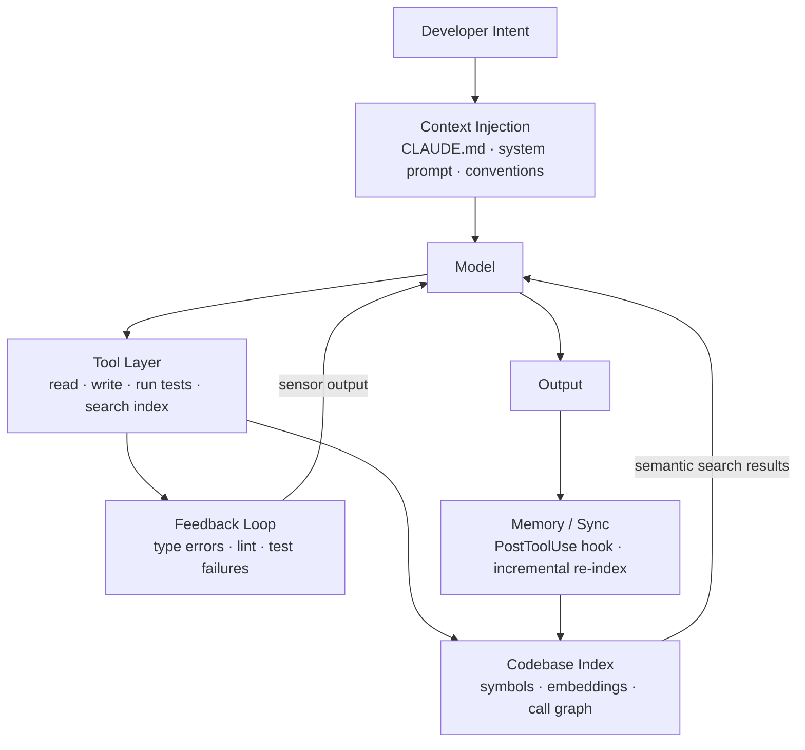
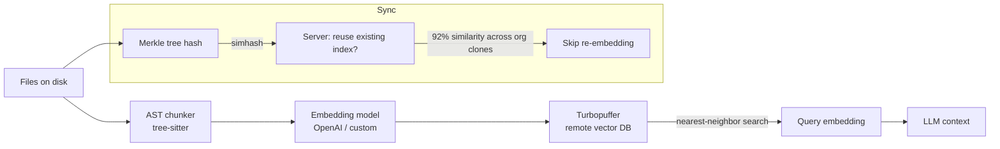
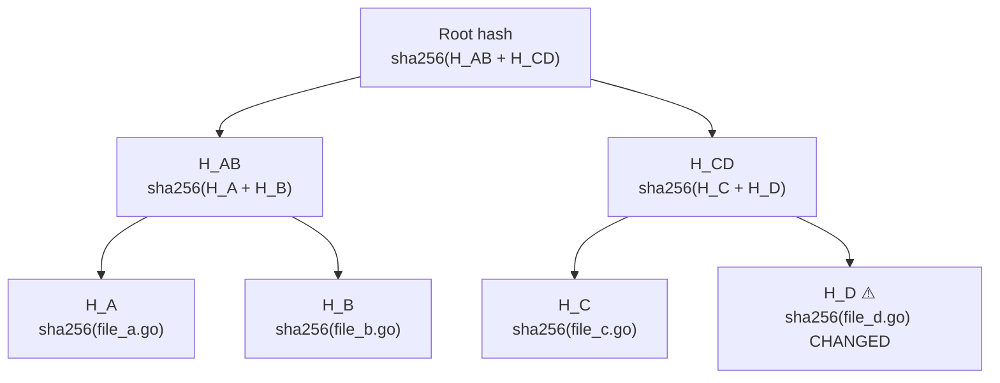
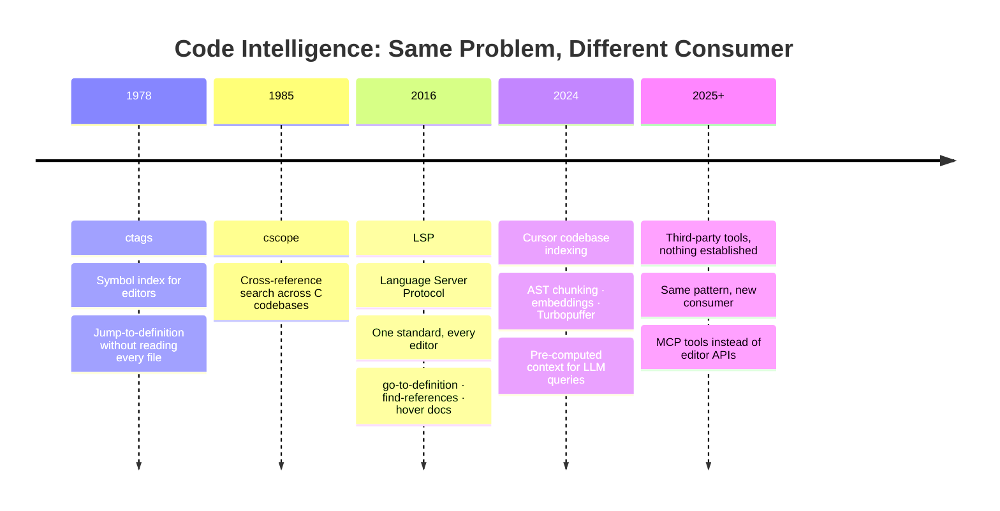
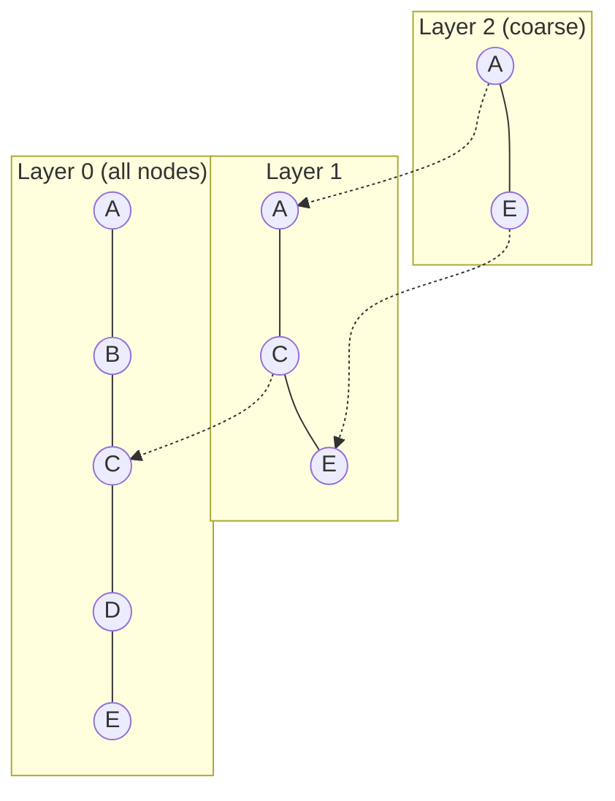
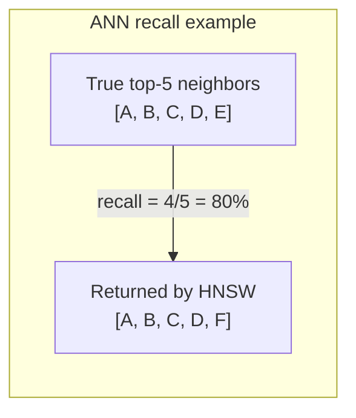
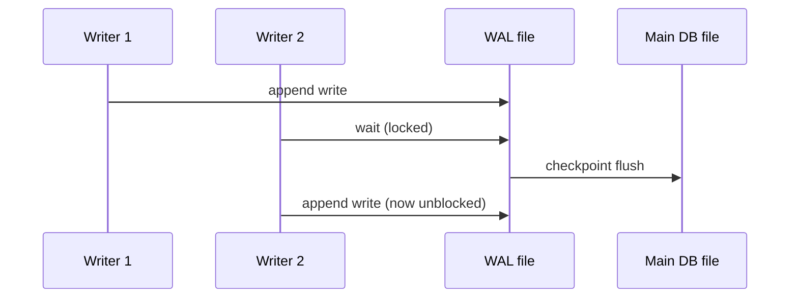
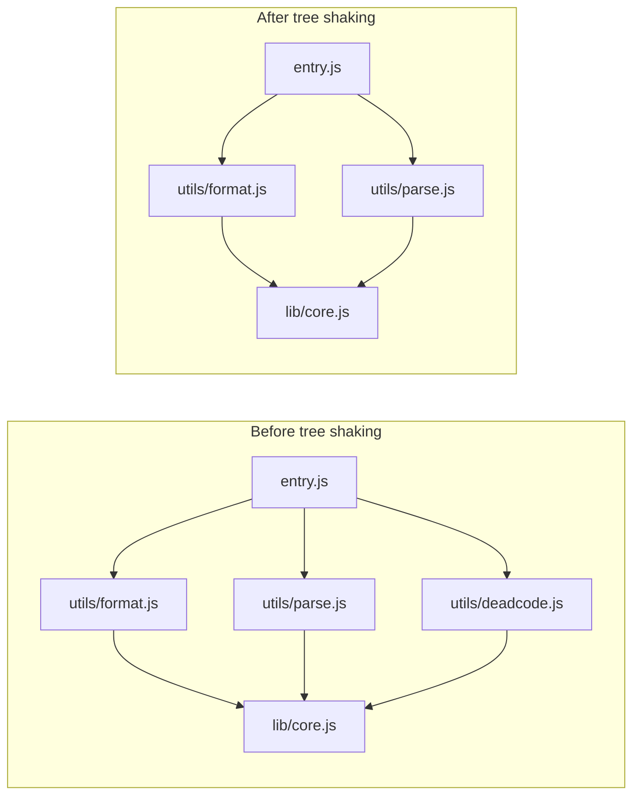
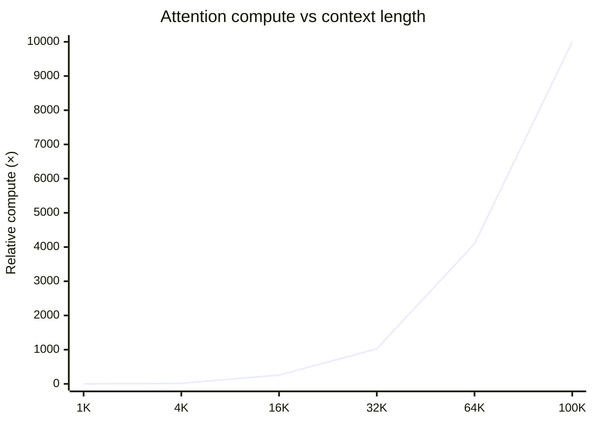

## What Is a Coding Harness?

**Agent = Model + Harness**. The model is the reasoning engine. The harness is everything else — the guides that steer it before it acts, the sensors that catch it after it does. ([Harness Engineering](https://martinfowler.com/articles/harness-engineering.html)).

In practice a coding harness has several moving parts:

- **Context injection** — what the agent knows before it writes a line. CLAUDE.md files, system prompts, project conventions.
- **Codebase indexing** — a queryable map of the repo. Symbols, call graphs, semantic embeddings.
- **Tool layer** — what the agent can *do*. Read files, run tests, call linters, search the index.
- **Feedback loop** — sensors that observe output quality. Type errors, failing tests, lint violations, architecture drift.
- **Memory / sync** — persistence across sessions. Hooks that re-index on session start, sync on file write.


```mermaid
graph TD
    A[Developer Intent] --> B[Context Injection<br/>CLAUDE.md · system prompt · conventions]
    B --> C[Model]
    C --> D[Tool Layer<br/>read · write · run tests · search index]
    D --> E[Codebase Index<br/>symbols · embeddings · call graph]
    E -->|semantic search results| C
    D --> F[Feedback Loop<br/>type errors · lint · test failures]
    F -->|sensor output| C
    C --> G[Output]
    G --> H[Memory / Sync<br/>PostToolUse hook · incremental re-index]
    H --> E
```

The vocabulary here is not new. Russell & Norvig’s *AI: A Modern Approach* (1995) defined an agent as anything that perceives its environment through **sensors** and acts upon it through **actuators**. Chip Huyen applies this directly to modern LLM agents in [Agents](https://huyenchip.com/2025/01/07/agents.html) (2025): the model is the brain, tools are the actuators, observations are the sensors. Böckeler maps the same structure onto coding harnesses — guides are actuators (steer behavior forward), sensors are feedback mechanisms (observe what came out).

The naming changed. The pattern did not.

Most Claude Code users already have tools and project instructions. Code indexing is less common, and it may help when repeated repository searches slow the work down.

---

## Claude Code: Hooks and Harness Points

Claude Code exposes four hook events:

| Hook | Fires when | Harness use |
|---|---|---|
| `SessionStart` | Agent session begins | Re-index codebase, load project state |
| `PreToolUse` | Before any tool call | Gate dangerous ops, inject context |
| `PostToolUse` | After Write/Edit | Sync modified file back to index |
| `Stop` | Agent finishes | Run validators, emit summaries |

Hooks can connect an agent session to project state and run checks around tool calls. A `SessionStart` hook can refresh an index, and a `PostToolUse` hook can ask it to update after a file changes. Neither guarantees that the index is complete or current. Keep ordinary search and validation available.

Git worktrees give parallel sessions separate working directories, but they do not copy local environment files. This example links `.env` into another worktree. Use it only for credentials you are willing to expose to that coding session; it is not a general secrets-management boundary.

For example:

```bash
#!/usr/bin/env bash
# .claude/hooks/session-start.sh
# Symlink .env from the main worktree into the current worktree on session start.

MAIN_WORKTREE=$(git worktree list --porcelain | awk 'NR==1{print $2}')
CURRENT_DIR=$(pwd)

if [ "$CURRENT_DIR" != "$MAIN_WORKTREE" ] && [ -f "$MAIN_WORKTREE/.env" ]; then
  ln -sf "$MAIN_WORKTREE/.env" "$CURRENT_DIR/.env"
  echo "Linked .env from $MAIN_WORKTREE"
fi
```

Wire it in `.claude/settings.json`:

```json
{
  "hooks": {
    "SessionStart": [
      {
        "matcher": "",
        "hooks": [
          {
            "type": "command",
            "command": "bash .claude/hooks/session-start.sh"
          }
        ]
      }
    ]
  }
}
```

The hook runs once per session and links `.env` from the main worktree into a secondary worktree. It avoids a copy, but it does not ensure that the file is current or safe to expose to the agent.

Claude Code also provides a `WorktreeCreate` hook for its `--worktree` workflow. See the [hook reference](https://code.claude.com/docs/en/hooks#worktreecreate).

---

## Cursor: Where Codebase Indexing Comes Built-In

Cursor does not make you wire this up yourself. It ships with persistent, background codebase indexing as a first-class feature. On session open, it already knows your symbols, your imports, your function signatures. Retrieval is a lookup, not an exploration.

In my experience, Cursor's index helps with repetitive repository searches. I have not measured a general improvement in accuracy or token use, so treat that as a workflow observation rather than a benchmark.

How Cursor's indexing pipeline ([docs](https://cursor.com/blog/secure-codebase-indexing)) works:


```mermaid
graph LR
    A[Files on disk] --> B[AST chunker<br/>tree-sitter]
    B --> C[Embedding model<br/>OpenAI / custom]
    C --> D[Turbopuffer<br/>remote vector DB]
    D -->|nearest-neighbor search| E[Query embedding]
    E --> F[LLM context]

    subgraph Sync
        G[Merkle tree hash] -->|simhash| H[Server: reuse existing index?]
        H -->|92% similarity across org clones| I[Skip re-embedding]
    end

    A --> G
```

*Cursor indexes without storing filenames or source code — filenames are obfuscated, chunks are encrypted. Content proofs verify the client holds the file before results are returned.*

The Merkle tree + simhash combination is what makes org-wide index reuse possible. A Merkle tree hashes file content bottom-up — any change propagates to the root, so the root hash changes. Simhash produces a fingerprint of a document set where similar sets produce similar hashes. Together they let Cursor detect that your clone of a repo is 92% identical to one already indexed on the server, and skip re-embedding the matching chunks entirely.


```mermaid
graph TD
    R["Root hash\nsha256(H_AB + H_CD)"]
    H_AB["H_AB\nsha256(H_A + H_B)"]
    H_CD["H_CD\nsha256(H_C + H_D)"]
    H_A["H_A\nsha256(file_a.go)"]
    H_B["H_B\nsha256(file_b.go)"]
    H_C["H_C\nsha256(file_c.go)"]
    H_D["H_D ⚠️\nsha256(file_d.go) CHANGED"]

    R --> H_AB
    R --> H_CD
    H_AB --> H_A
    H_AB --> H_B
    H_CD --> H_C
    H_CD --> H_D
```
*One file changes → its leaf hash changes → H_CD changes → root changes. Cursor walks the diff, re-embeds only changed leaves. Unchanged subtrees reuse the existing index via `copy_from_namespace`.*

Median time-to-first-query for large repos dropped from **7.87s → 525ms** after Merkle-based index reuse shipped. ([Cursor: Secure Codebase Indexing](https://cursor.com/blog/secure-codebase-indexing)) (note: for some reason the link only redirects to the CN article, not the English one.)

The vector store behind this is [Turbopuffer](https://turbopuffer.com/customers/cursor). Cursor runs one namespace per codebase — active ones stay hot in memory/NVMe, inactive ones spill to object storage. At scale: **1T+ documents across 80M+ namespaces**, 10GB/s peak ingestion. Cold namespaces resume without re-embedding via `copy_from_namespace`, which is how the 92% org-clone similarity translates into actual latency savings rather than just a stat. Cursor moved to Turbopuffer in November 2023 and cut semantic search costs by 20x. Agent accuracy improved up to **23.5%** after the switch.

From [entire.io's analysis](https://entire.io/blog/improving-agentic-search-in-coding-agents): nearly **49% of all agent tool calls are search operations**. That is the exploration tax — paid in latency and tokens on every task that Cursor's index would answer instantly.


*Agent tool call breakdown. Nearly half of all calls are search. Source: [entire.io — Improving Agentic Search in Coding Agents](https://entire.io/blog/improving-agentic-search-in-coding-agents)*


*Tool execution is only 0.4% of wall-clock time. The bottleneck is model inference and planning, not search speed. Source: [entire.io — Improving Agentic Search in Coding Agents](https://entire.io/blog/improving-agentic-search-in-coding-agents)*

Claude Code offers more ways to connect external tools, but it does not provide the same built-in persistent codebase index described above. The next section looks at third-party options.

---

## We Have Done This Before

Here is the part that should sting: none of this is new.

**ctags** (1978) built symbol indexes so editors could jump to definitions without reading every file. 
**cscope** (1985) did cross-reference search across C codebases. 
**Language servers** (LSP, 2016) gave every editor a real-time semantic model of the code — go-to-definition, find-references, hover docs — without re-parsing anything.

The entire Language Server Protocol exists because editors kept re-implementing the same code intelligence in isolation. Microsoft proposed a standard. The ecosystem converged. Problem solved for the editor layer.

Now in 2026 we are building the same thing again for AI agents. Semantic codebase indexes. Symbol-aware chunking. Incremental sync. The concepts are identical. The target consumer changed from "editor plugin" to "LLM tool call."

We are not solving a new problem. We are re-plumbing an old one.


```mermaid
timeline
    title Code Intelligence: Same Problem, Different Consumer
    1978  : ctags
          : Symbol index for editors
          : Jump-to-definition without reading every file
    1985  : cscope
          : Cross-reference search across C codebases
    2016  : LSP
          : Language Server Protocol
          : One standard, every editor
          : go-to-definition · find-references · hover docs
    2024  : Cursor codebase indexing
          : AST chunking · embeddings · Turbopuffer
          : Pre-computed context for LLM queries
    2025+ : Third-party tools, nothing established
          : Same pattern, new consumer
          : MCP tools instead of editor APIs
```

---

## Tools That Already Exist

Here are some of the tools I've tried over the last few months.


### [ory/lumen](https://github.com/ory/lumen)

Lumen is the closest thing the ecosystem has to a production-grade answer for Claude Code indexing. Single static binary, no Docker, no Python environment to manage. Install as a Claude Code plugin:

```bash
/plugin install lumen@ory
```

**What it does well:**

- AST-aware chunking via tree-sitter — splits at function boundaries, not arbitrary character windows. A retrieved chunk is a complete function, not lines 47–89 of one. An AST (Abstract Syntax Tree) is the parsed structure of source code — a tree where each node is a language construct: function, class, method, variable. Splitting at those boundaries means every retrieved chunk is a complete, meaningful unit.

  ```mermaid
  graph TD
      A["source file"] --> B["module"]
      B --> C["class Config"]
      B --> D["function parse_config"]
      B --> E["function validate"]
      D --> F["param: path"]
      D --> G["body: open · load · validate · return"]
      C --> H["field: host"]
      C --> I["field: port"]
  ```
  *AST of a small Python module. Each node is a language construct. Chunking at `function` or `class` nodes produces self-contained units — not mid-expression fragments.*

  **Naive window chunking** (500-char sliding window) might split this Python function arbitrarily:

  ```python
  # Chunk 1 (chars 0-500) — cuts mid-function
  def parse_config(path: str) -> Config:
      """Load and validate config from disk."""
      with open(path) as f:
          raw = yaml.safe_load(f)
      if "database" not in raw:
          raise ValueError("missing database
  # Chunk 2 (chars 500-1000) — starts mid-expression, no context
           key")
      return Config(
          host=raw["database"]["host"],
          port=raw["database"].get("port", 5432),
      )
  ```

  **AST-aware chunking** (tree-sitter, function boundary):

  ```python
  # Chunk: parse_config — complete, self-contained
  def parse_config(path: str) -> Config:
      """Load and validate config from disk."""
      with open(path) as f:
          raw = yaml.safe_load(f)
      if "database" not in raw:
          raise ValueError("missing database key")
      return Config(
          host=raw["database"]["host"],
          port=raw["database"].get("port", 5432),
      )
  ```

  The second chunk is retrievable, understandable, and embeds with full semantic context. The first produces garbage embeddings for the second half.
- Code-optimized embeddings: `jina-embeddings-v2-base-code` (512-dim), trained on code rather than general text.
- SQLite-vec as the vector store — embedded, zero infrastructure, single file on disk.
- `SessionStart` hook auto-wired on install. Index is fresh at the start of every session.
- Benchmarked: **26–39% token cost reduction**, **28–53% faster sessions** vs. baseline Claude Code.

In practice, indexing a medium Go service (220 files) takes ~9 minutes. A large polyglot monorepo (6,000+ files) can run for hours — and if you interrupt it, that nested repo logs zero chunks:

```
$ lumen index .
 INFO  Indexing nested repo /work/common-packages
Embedded 36 chunks so far [12/12] ████████████████████████████████████████ 100%
Indexing complete: 12 files, 36 chunks in 10.453s.
 INFO  Indexing nested repo /work/project-a
Embedded 2178 chunks so far [220/220] ████████████████████████████████████ 100%
Indexing complete: 220 files, 2178 chunks in 9m9.039s.
 INFO  Indexing nested repo /work/platform-repo
Processing file 368/6375: environments/development/... [0367/6375]    6%
Processing file 1601/6375: environments/production/... [1600/6375]   25%
Processing file 3298/6375: environments/production/.../... [3297/6375]   52% ^C
Nested repo /work/platform-repo: 0 files, 0 chunks in 3h15m16.412s.
 INFO  Indexing nested repo /work/project-b
Indexing complete: 176 files, 2168 chunks in 9m17.342s.
```

Overall, I'll be running this for hours and I am, when I want to capture the full scope.

**Where it struggles:**

`sqlite-vec` is an embedded vector-search extension for SQLite. It needs no separate service, but its current search path scans candidate vectors rather than using the HNSW graph described below. SQLite allows only one writer at a time, which can matter if indexing and querying both write concurrently.

HNSW (Hierarchical Navigable Small World) is the dominant algorithm for approximate nearest-neighbor vector search — it builds a multi-layer graph where each layer skips further ahead, letting queries find close vectors in O(log n) rather than scanning everything.


```mermaid
graph TD
    subgraph "Layer 2 (coarse)"
        L2A((A)) --- L2E((E))
    end
    subgraph "Layer 1"
        L1A((A)) --- L1C((C))
        L1C --- L1E((E))
    end
    subgraph "Layer 0 (all nodes)"
        L0A((A)) --- L0B((B))
        L0B --- L0C((C))
        L0C --- L0D((D))
        L0D --- L0E((E))
    end
    L2A -.-> L1A
    L2E -.-> L1E
    L1C -.-> L0C
```
*HNSW graph layers. Query enters at the top (coarsest), greedily descends to the nearest node, then refines at each lower layer. Search cost is O(log n) instead of O(n).*

Dedicated vector stores built around HNSW handle graph construction and search on separate threads, persist the graph independently from the payload store, and support filtered search without degrading ANN recall — how many of the true nearest neighbors the approximate search actually returns (filters discard candidates before graph traversal completes, shrinking recall).


```mermaid
graph LR
    subgraph "ANN recall example"
        T["True top-5 neighbors\n[A, B, C, D, E]"]
        R["Returned by HNSW\n[A, B, C, D, F]"]
        T -->|"recall = 4/5 = 80%"| R
    end
```
*Recall@5 = 80% here. E was a true neighbor; F was not. Filtered search (e.g. kind=function only) shrinks the candidate set, making misses more likely.*

SQLite-vec serialises everything through SQLite's WAL (Write-Ahead Log) — providing crash safety but queuing concurrent writers behind each other.


```mermaid
sequenceDiagram
    participant W1 as Writer 1
    participant W2 as Writer 2
    participant WAL as WAL file
    participant DB as Main DB file

    W1->>WAL: append write
    W2->>WAL: wait (locked)
    WAL->>DB: checkpoint flush
    W2->>WAL: append write (now unblocked)
```
*SQLite WAL serialises concurrent writers. Fine for single-process use; degrades when indexer and query server write simultaneously at scale.*

At small scale the difference is invisible. Across a large monorepo (thousands of files, millions of chunks), query latency climbs.

**The macOS MCP server is currently broken.**

[Issue #136](https://github.com/ory/lumen/issues/136) and [Issue #152](https://github.com/ory/lumen/issues/152) document the same failure: after installing, the MCP server does not connect on macOS. The root cause is a POSIX shebang detection problem — `posix_spawn` requires bytes 0–1 to be `#!`, but a previous PR removed the shebang from `scripts/run.cmd` to fix Windows `cmd.exe` stdout cleanliness. The two constraints are mutually exclusive in a polyglot file.

[PR #154](https://github.com/ory/lumen/pull/154) (open at time of writing) fixes this by routing Claude Code and Cursor through a Node.js dispatcher (`run.cjs`) that invokes `run.sh` on Unix and `run.bat` on Windows. Until that merges, the workaround from issue #152 applies: edit `plugin.json` to point `command` at `scripts/run.sh` instead of `scripts/run.cmd`.

Lumen is the right direction. It is not stable enough yet for teams that cannot tolerate manual workarounds on install.

---

### [ruvnet/ruflo](https://github.com/ruvnet/ruflo)

Ruflo takes the opposite approach. Where Lumen is a focused indexing tool, Ruflo is an entire orchestration platform: 100+ specialized agents, multi-agent swarms, federation with mTLS, a built-in vector database (AgentDB with HNSW), 27 hooks, cost tracking, PII detection, and support for five LLM providers.

On paper, it solves everything at once. In practice, that is the problem.

Ruflo suffers from the same pattern this article argues against: instead of composing small, well-understood tools, it builds a new layer on top of everything. The HNSW-backed AgentDB is faster than brute-force search, but you are running an entire orchestration platform to get what Lumen gives you with a single binary and a plugin install.

The token usage story is telling. Ruflo claims "75% API cost reduction" through intelligent routing and agent specialization. But coordinating swarms of agents — planning, inter-agent communication, orchestration overhead — consumes tokens too. Trading exploration tax for coordination tax is not obviously a win. It is tokenmaxxing with extra steps.

For a small codebase or a single focused project, Ruflo is solving problems you do not have. For a large enterprise deployment with genuine multi-agent needs, the complexity may be justified — but at that scale you have the engineering capacity to manage it.

The signal worth watching: Ruflo benchmarks well on SWE-Bench (84.8%). The approach is not wrong. It is aimed at a different problem than the one most developers face when their agent spends 49% of its time searching.

---

## Running Local Embeddings with mlx-lm

I'm currently experimenting with a MacBook Pro M5 pro with 48GB unified memory, you do not need to call an external API for embeddings. You can run better models locally than what most hosted RAG stacks use by default.

[mlx-openai-server](https://github.com/cubist38/mlx-openai-server) is the right tool here. MLX is designed for Apple silicon and uses its unified memory architecture. I did not benchmark it against Ollama or llama.cpp here, and using MLX does not mean a model runs on the Neural Engine. This specific server provides an Embeddings endpoint in an OpenAI API compatible structure. I'd use `mlx-lm` directly, but this actually worked.

```bash
uv tool install mlx-openai-server


# Serve an embedding-capable model
mlx-openai-server launch \
  --model-type embeddings \
  --model-path mlx-community/Qwen3-Embedding-8B-4bit-DWQ
```

Then point your indexer at `http://localhost:8080/v1/embeddings`. In my setup, the quantized Qwen3 embedding model used about 6 GB of unified memory and returned 4096-dimensional vectors. A larger vector is not automatically better; compare retrieval quality on your own code questions.

The catch: **many tools misidentify hybrid decoder models as chat-only**. LM Studio, for instance, will not expose the embeddings endpoint for models it classifies as "LLM" rather than "Embedding Model." Had this issue with Qwen3-embeddings.

---

## What Needs to Be Better

The tooling exists. The patterns are proven. But the current state of the ecosystem has sharp edges:

**Model classification is broken.** Hybrid models that function as both chat and embedding models get misclassified by most GUI tools. There is no standard signal for "this model supports `/v1/embeddings`." You discover it by trying and failing.

**Chunking needs care.** A chunk that splits a function mid-expression can lose useful context. Syntax-aware chunking may help, but it does not guarantee better retrieval. Check whether results include the surrounding code needed to understand callers and data flow.

Tree shaking is a related but distinct idea from frontend build tooling — it eliminates dead code at bundle time by statically analyzing the import graph. Same goal (less junk in the output), different target: the compiled bundle, not the retrieval index. Worth naming because the terms get conflated when people discuss "pruning" what the agent sees.


```mermaid
graph LR
    subgraph "Before tree shaking"
        E[entry.js] --> A[utils/format.js]
        E --> B[utils/parse.js]
        E --> C[utils/deadcode.js]
        A --> D[lib/core.js]
        B --> D
        C --> D
    end
    subgraph "After tree shaking"
        E2[entry.js] --> A2[utils/format.js]
        E2 --> B2[utils/parse.js]
        A2 --> D2[lib/core.js]
        B2 --> D2
    end
```
*Tree shaking removes `utils/deadcode.js` — never called from the entry point. The bundler traces imports statically and drops unreachable modules. This is compile-time pruning, not retrieval-time pruning.*

**No standard MCP schema for code search.** Every indexer invents its own tool names and return shapes. `search_code`, `find_symbol`, `semantic_search` — same operation, different contracts. The LSP standardization moment for AI tools has not happened yet.

**Index drift under heavy editing.** A hook that updates one file at a time may leave a multi-file refactor only partly indexed. An indexer should report when it is rebuilding and whether results match the current checkout. File watchers can help, but they add another process to maintain.

**Cost of the first index.** On a large monorepo, initial indexing is slow and can be expensive if using a hosted embedding API. Local MLX models eliminate the API cost but the wall-clock time remains. There is no good incremental-from-scratch story yet.

---

## Or Maybe the Whole Approach Is Wrong

Before concluding that the harness is the answer, it is worth holding the contrarian position: [subQ](https://subq.ai/introducing-subq) argues the harness is a workaround for an architectural defect, not a solution.

Their thesis: RAG pipelines, chunking strategies, and retrieval systems exist because transformer attention is quadratic — every token compared against every token, cost exploding as context grows. In a sequence of N tokens, standard attention computes N² comparisons per layer. Double the context, quadruple the cost. At 100K tokens that's 10 billion operations per layer.


```mermaid
xychart-beta
    title "Attention compute vs context length"
    x-axis ["1K", "4K", "16K", "32K", "64K", "100K"]
    y-axis "Relative compute (×)" 0 --> 10000
    line [1, 16, 256, 1024, 4096, 10000]
```
*Quadratic scaling. 1K tokens = 1× baseline. 100K tokens = 10,000× baseline. This is why RAG exists — it keeps the effective context small.*

The industry adapted by building retrieval *around* the model rather than fixing the model. As they put it: "Developers and investors spend more of their time and money on workarounds than on the problem itself."


*The workaround stack. Source: [subQ — Introducing subQ](https://subq.ai/introducing-subq)*

SubQ's answer is a subquadratic architecture that reduces attention compute by ~1,000x at 12M tokens — making it theoretically possible to drop the entire codebase into context rather than retrieving fragments of it.

If that architecture holds at production scale, the harness layer becomes thinner: less indexing infrastructure, less retrieval tuning, less chunking strategy. The exploration tax disappears not because you built a better index but because the model no longer needs one.

That future may come. It is not here yet. Until inference cost and context reliability at multi-million-token scale match what a well-tuned retrieval harness delivers today, the harness is the practical answer. But subQ's framing is useful: every layer of your harness is a bet that the model will not outgrow the need for it. Some of those bets will lose.

We'll see.

---

## For the Harness reality now, the Pattern that matters

The harness is not the model. The model is a commodity. What separates a working AI coding setup from an expensive one is the infrastructure around it — the index that gives it situational awareness, the hooks that keep that index current, the sensors that catch mistakes before they land in production.

Less tokens. More signal. That is the job.

Engineers who understand what is underneath their tools do not reach for more context — they reach for better context. The harness is how you stop paying the exploration tax and start getting work done.

The tools are there, the "glue" is still largely missing.