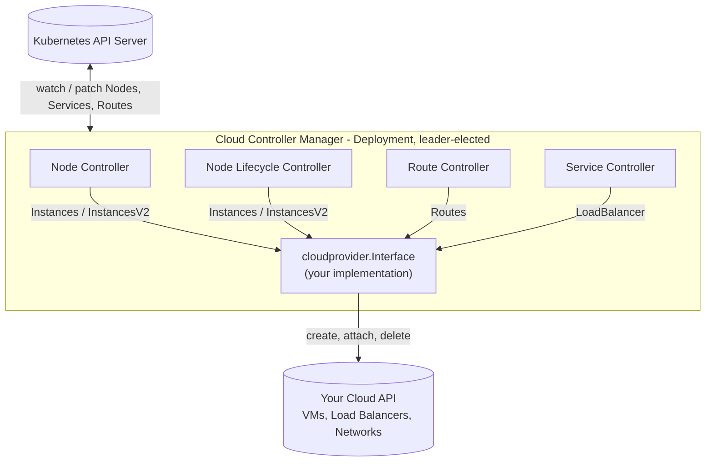
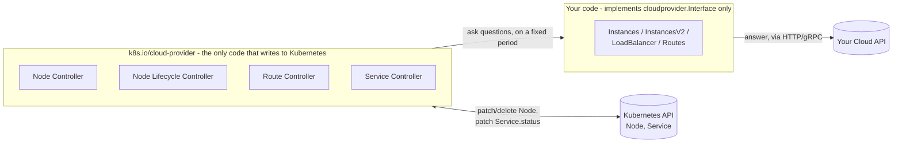
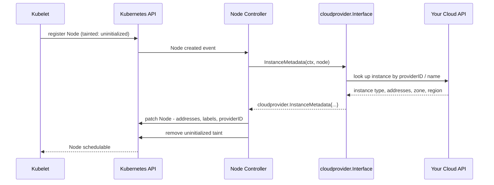
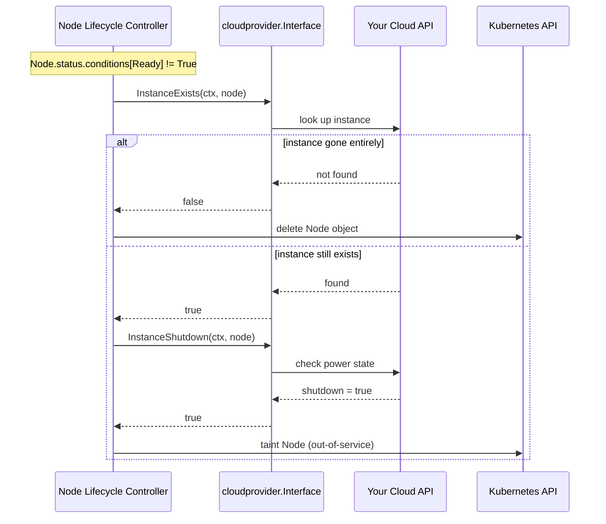
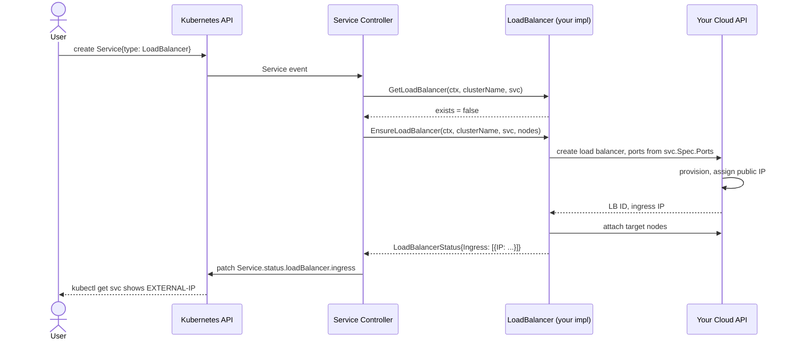
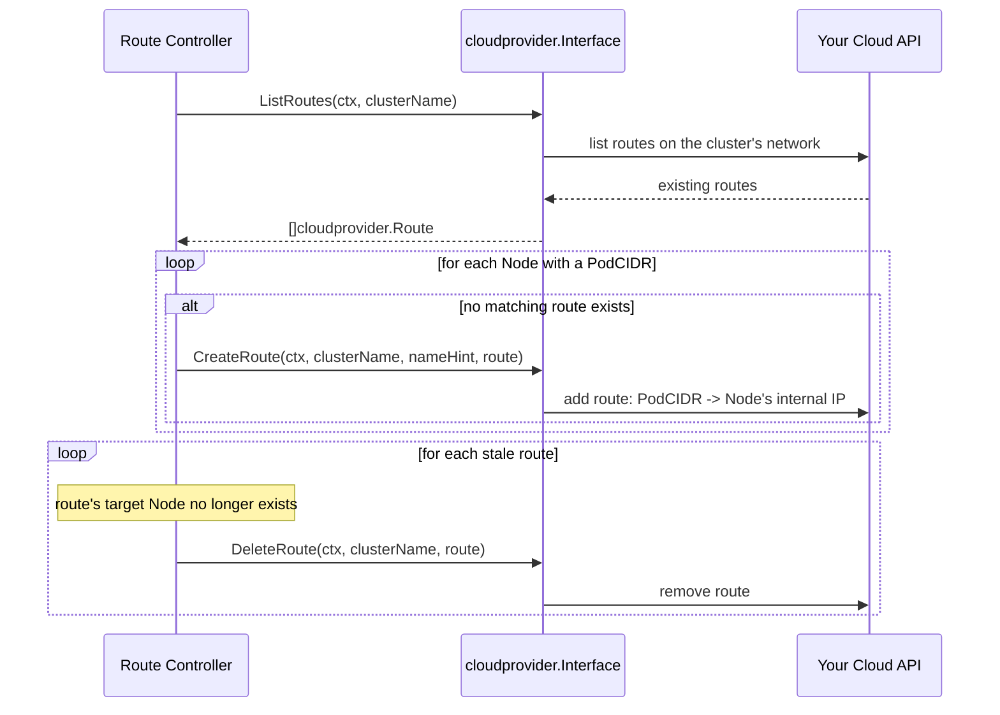
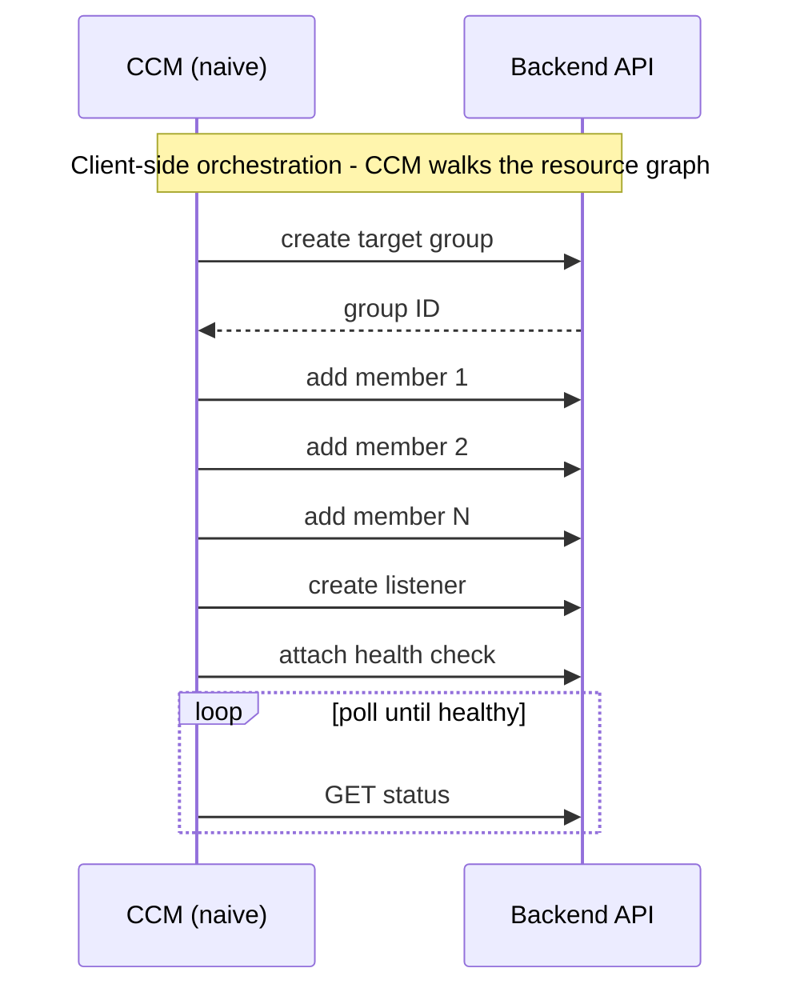
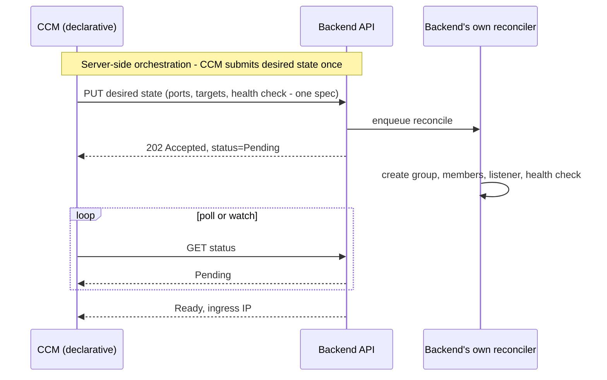

A Cloud Controller Manager is a bridge. On one side: a Kubernetes cluster that thinks in Nodes, Services, and Routes. On the other: whatever actually runs your machines and network - a hyperscaler like AWS, GCP, or Azure, or just as often a private cloud, a colocated rack, or a home lab. The CCM's whole job is translation - when a Node joins, ask the infrastructure what it knows about that machine and translate it onto the Node object; when a `Service` wants a load balancer, go create one and wire the ingress IP back into `status`. Without it, `kubectl get nodes` never gets a region label and `type: LoadBalancer` never gets an IP - Kubernetes has no idea any of that infrastructure exists.

I've spent a good chunk of time in this code, both building on top of [kubernetes/cloud-provider](https://github.com/kubernetes/cloud-provider) directly and reading through what Hetzner's and DigitalOcean's CCMs do differently. This post covers the interface, the four control loops that drive it, the full node/route/service lifecycle, and the patterns worth stealing once you've got the basics working.

---

## What is a CCM?

Cloud providers used to be compiled directly into `kube-controller-manager` - the same coupling problem CSI solved for storage. If you've ever run a non-cloud cluster and watched the logs fill up with a cloud provider that isn't even yours failing to authenticate, that's the symptom. The [Kubernetes docs on cloud controller manager architecture](https://kubernetes.io/docs/concepts/architecture/cloud-controller/) cover the history in more depth, but the short version is the same as CSI: in-tree providers moved out-of-tree, and `--cloud-provider=external` is how a cluster says "ask a separate binary."

That separate binary runs as a Deployment, leader-elected, watching the Kubernetes API and calling out to your infrastructure's API:



Everything downstream of that diagram is one interface and four controllers that call into it.

---

## The `cloudprovider.Interface`

Everything a CCM can do is exposed through one interface, `k8s.io/cloud-provider`'s `Interface`. You implement the pieces relevant to your infrastructure; each accessor also returns a `bool` so the controller manager can skip wiring up a controller you don't support:

```go
type Interface interface {
    Initialize(clientBuilder ControllerClientBuilder, stop <-chan struct{})
    LoadBalancer() (LoadBalancer, bool)
    Instances() (Instances, bool)
    InstancesV2() (InstancesV2, bool)
    Zones() (Zones, bool)
    Clusters() (Clusters, bool)
    Routes() (Routes, bool)
    ProviderName() string
    HasClusterID() bool
}
```

- **`LoadBalancer`** - `GetLoadBalancer`, `EnsureLoadBalancer`, `UpdateLoadBalancer`, `EnsureLoadBalancerDeleted`. Backs every `type: LoadBalancer` Service.
- **`Instances` / `InstancesV2`** - node identity: provider ID, instance type, addresses, zone/region. `InstancesV2` is the one to implement today - it's a single batched `InstanceMetadata` call instead of five separate RPCs, and implementing it **disables the `Zones` interface entirely** (more on that in pitfalls).
- **`Zones`** - deprecated, superseded by the zone/region fields on `InstancesV2.InstanceMetadata`. Only implement it if you're stuck on the legacy `Instances` interface.
- **`Routes`** - pod-network routing at the infrastructure level (cloud-native VPC routes instead of a CNI overlay). Most clusters running Calico, Cilium, or another overlay-capable CNI don't need this at all.
- **`Clusters`** - vestigial; almost nothing implements it.

`Initialize` is the interesting one: it hands you a `ControllerClientBuilder` and a stop channel, and you can spawn your own goroutines and controllers from there - the interface isn't the only thing driving behavior, as we'll see in the patterns section.

---

## The Four Controllers

Same shape as CSI's sidecars: you don't call your driver directly, the controllers do, in response to Kubernetes API state.

| Controller | Watches | Calls |
|---|---|---|
| **Node controller** | new Nodes | `Instances`/`InstancesV2` - labels addresses, zone, instance type; removes the `uninitialized` taint |
| **Node lifecycle controller** | Node `Ready` condition | `InstanceExists`/`InstanceShutdown` - taints or deletes Nodes whose backing instance is gone or stopped |
| **Route controller** | Nodes, pod CIDRs | `Routes` - creates/deletes cloud-native routes so pod traffic reaches the right node |
| **Service controller** | `type: LoadBalancer` Services | `LoadBalancer` - provisions/updates/deletes the load balancer, patches `status.loadBalancer.ingress` |

All four are workqueue-based `client-go` controllers under the hood - same `informer → workqueue → worker → syncHandler` shape you'd write by hand for any custom controller.

---

## The CCM as a Client, Not a Controller

It's easy to mistake "watches the Kubernetes API, reacts to changes" with "operator." A CCM does watch and react, but the write side of that loop is much narrower than an Operator's or a Cluster API infrastructure provider's. An Operator (or a Cluster API provider) typically owns one or more CRDs: it defines the schema, runs a reconcile loop that drives observed state toward spec, and both reads and writes its own custom resources, sometimes provisioning infrastructure as a result. A CCM does none of that. It defines no CRDs, runs no admission webhook for custom types, and your own `cloudprovider.Interface` implementation never touches a `kubeClient` at all.

Look back at the four-controllers table above: every Kubernetes write (patching a Node's labels, removing a taint, deleting a Node, patching `Service.status`) happens inside the four controllers `k8s.io/cloud-provider` already ships, not in code you write. Your job is answering their questions (does this instance exist, what's its zone, does this Service have a load balancer yet), and every answer you give is a call to somebody else's API, not a write to Kubernetes:



That narrow footprint is also why a CCM's consistency model can afford to be "best-effort sync" instead of exactly-once. Each controller runs its own question on its own fixed period (`MonitorNodes` on `nodeMonitorPeriod`, service syncs pulled off a workqueue by N workers) instead of as one atomic transaction across Kubernetes and your cloud. A failed `EnsureLoadBalancer` this cycle isn't a lost transaction that needs a saga to unwind; it's a workqueue item that gets requeued and tried again next resync.

That's a deliberate simplification. It's why the sequential, hand-rolled orchestration from the reconcile-in-the-backend section is unnecessary, and it's why the best-effort retry pattern in the concurrency section above is safe: "retry next cycle" is a far more forgiving contract than "must not partially apply."

Strip away the Kubernetes framing and what's left is a plain client-integration problem: your code holds a long-lived connection to someone else's API, on a fixed poll cadence, at whatever scale the cluster grows to. That's the same set of problems any SDK client talking to someone else's backend has to solve - and it's worth treating them as first-class instead of incidental.

### Being a Well-Behaved Client

**Deadlines everywhere, not just at the edge.** Every `cloudprovider.Interface` method already gets a `ctx` from the controller calling it - the mistake is dropping it once you're inside your own client, whether that's an `http.Client` built without `NewRequestWithContext` or a goroutine that outlives the call that spawned it. A dropped deadline doesn't just risk hanging - it leaves your backend holding a connection or a slot for work nobody is waiting on anymore:

```go
func (c *Client) createLoadBalancer(ctx context.Context, spec LBSpec) (*LB, error) {
    req, err := http.NewRequestWithContext(ctx, http.MethodPost, c.baseURL+"/load-balancers", encode(spec))
    if err != nil {
        return nil, err
    }
    resp, err := c.http.Do(req) // ctx.Done() aborts the round trip itself, not just the wait
    if err != nil {
        return nil, err
    }
    defer resp.Body.Close()
    return decodeLB(resp)
}
```

**Classify errors before you retry them.** Not every failure is worth retrying, and retrying the wrong ones burns the budget you need for the right ones. A `400` means your request is malformed - retrying it just repeats the mistake. A `429` or `503` means "try again later" - that's the one your backoff is for:

```go
type errClass int

const (
    errTerminal errClass = iota
    errRetryable
)

func classify(err error) errClass {
    var apiErr *cloudapi.Error
    if errors.As(err, &apiErr) {
        switch apiErr.StatusCode {
        case http.StatusTooManyRequests, http.StatusServiceUnavailable, http.StatusGatewayTimeout:
            return errRetryable
        case http.StatusBadRequest, http.StatusNotFound, http.StatusConflict:
            return errTerminal
        }
    }
    if errors.Is(err, context.DeadlineExceeded) {
        return errRetryable
    }
    return errTerminal
}
```

**Backoff needs jitter, or you've just rescheduled the thundering herd.** Plain exponential backoff - `base * 2^attempt` for every caller - synchronizes retries instead of spreading them: every replica that failed at the same instant also retries at the same instant, at every subsequent step. This is the same failure mode written up in [AWS's Builders' Library work on backoff and jitter](https://aws.amazon.com/blogs/architecture/exponential-backoff-and-jitter/) - the fix isn't backoff, it's randomizing *within* the backoff window so retries decorrelate:

```go
func backoff(attempt int) time.Duration {
    base, max := 250*time.Millisecond, 30*time.Second
    d := base * time.Duration(1<<attempt)
    if d > max {
        d = max
    }
    return time.Duration(rand.Int63n(int64(d))) // full jitter: uniform in [0, d)
}
```

**Rate limit yourself - a bursty client is the backend's reliability problem, not just yours.** A CCM watching thousands of Nodes and Services can generate real bursts: a cold-start sync on restart, a mass Node replacement during a cluster upgrade, a Service migration. From the backend's side, an unthrottled burst looks the same regardless of intent, and it's exactly what turns a blip into a [retry storm](https://medium.com/agoda-engineering/how-agoda-solved-retry-storms-to-boost-system-reliability-9bf0d1dfbeee) - each layer's retries amplifying load on the layer below it. Pairing a client-side token bucket with the backend's documented limits makes your throughput predictable instead of bursty-then-reactive:

```go
type Client struct {
    http    *http.Client
    limiter *rate.Limiter // e.g. rate.NewLimiter(rate.Limit(5), 10): 5 req/s, burst 10
}

func (c *Client) do(ctx context.Context, req *http.Request) (*http.Response, error) {
    if err := c.limiter.Wait(ctx); err != nil { // blocks for a token, or dies with ctx
        return nil, err
    }
    return c.http.Do(req)
}
```

**Honor the backend's own backpressure signal instead of guessing.** When you do get throttled, a `429` usually comes with a `Retry-After` header - the backend telling you, specifically, how long it needs. That's better information than your own backoff curve; fold it in when present instead of overriding it:

```go
func retryAfter(resp *http.Response) (time.Duration, bool) {
    v := resp.Header.Get("Retry-After")
    if v == "" {
        return 0, false
    }
    if secs, err := strconv.Atoi(v); err == nil {
        return time.Duration(secs) * time.Second, true
    }
    if t, err := http.ParseTime(v); err == nil {
        return time.Until(t), true
    }
    return 0, false
}
```

**Jitter your resync cadence too, not just your retries.** The node lifecycle controller's `MonitorNodes` loop and the service controller's periodic resync both run on a fixed period. That's fine for one replica - but a managed backend usually isn't serving one CCM, it's serving one per cluster, across a whole fleet. If every replica restarts around the same event - a rollout, a shared dependency recovering from an outage - and all of them resync on the same fixed period, they knock on the backend's door in lockstep, forever. `wait.JitterUntil`, already in `k8s.io/apimachinery`, spreads that out for free:

```go
// Fixed period: every replica in the fleet converges on the same tick.
wait.UntilWithContext(ctx, c.MonitorNodes, c.nodeMonitorPeriod)

// Jittered: each replica's period wobbles +/-20%, so a fleet restart doesn't sync up.
wait.JitterUntil(func() { c.MonitorNodes(ctx) }, c.nodeMonitorPeriod, 0.2, true, ctx.Done())
```

None of this is Kubernetes-specific - it's the same checklist you'd run for any SDK client talking to someone else's API. The Kubernetes-specific part is just knowing where your write boundary actually ends: at the edge of `cloudprovider.Interface`, not inside the four controllers, and not anywhere near a `kubeClient`.

---

## Node Initialization

Every Node that joins a cluster running `--cloud-provider=external` is born with a taint:

```
node.cloudprovider.kubernetes.io/uninitialized:NoSchedule
```

Nothing gets scheduled onto it until the CCM removes that taint - which it only does after successfully fetching instance metadata from your cloud:



The taint is the whole safety mechanism: if the CCM is down when a Node joins, that Node sits `NoSchedule` forever - no pods land on it, silently, until the CCM comes back and processes it. It's also why the CCM should run with more than one replica behind leader election; a single-replica CCM restart during a scale-up event stalls every new Node until the pod comes back.

---

## Node Lifecycle: Shutdown vs. Deleted

Not every cloud treats a stopped instance the same way. Some delete it outright; others leave it around, powered off, still holding its IP and disks. The node lifecycle controller has to handle both without mixing them up - deleting a Node object for an instance that's merely stopped would evict every pod on it unnecessarily:



`InstanceExists` returning `false` triggers immediate Node deletion - get that check wrong (e.g. a transient API timeout misread as "not found") and you'll delete Nodes for instances that are still very much running.

---

## Service → LoadBalancer Provisioning

The one most people actually care about:



`EnsureLoadBalancer` is called on create **and** on every relevant update - a node joining or leaving, a port changing, an annotation flipping. It has to be safe to call repeatedly against the same desired state, which is the whole idempotency discussion in the pitfalls section below.

---

## Route Reconciliation

Only relevant if your CNI relies on cloud-native routing instead of an overlay:



---

## Concurrency: Parallelize Carefully

Even with a declarative backend, one part stays the CCM's problem: attaching 50 nodes to a load balancer, or reconciling 200 Services, one at a time is slow, and the naive implementation of almost every reconcile loop is sequential by default - a `for` loop over targets, awaiting each call before starting the next. Fixing that has its own set of gotchas that are easy to get wrong in the other direction.

**Two different knobs, don't confuse them.** The controllers themselves have a concurrency setting - `--concurrent-service-syncs` controls how many *Services* get reconciled in parallel across the workqueue, by spawning that many worker goroutines pulling off one shared queue (`client-go`'s workqueue guarantees no two workers ever get the same key at once):

```go
// Controller-level: N Services reconciled in parallel - real code from
// k8s.io/cloud-provider's service controller.
for i := 0; i < workers; i++ {
    go wait.UntilWithContext(ctx, c.serviceWorker, time.Second)
}
```

That's a separate knob from what happens *inside* one `EnsureLoadBalancer` call. Turning up `--concurrent-service-syncs` just gets you more reconciles stuck in the same slow sequential loop at once, unless the loop itself is fixed too:

```go
// Sequential by default - one slow or failed call blocks every node after it.
func (l *loadBalancer) attachTargets(ctx context.Context, lb *LB, nodes []*v1.Node) error {
    for _, node := range nodes {
        if err := l.client.AttachTarget(ctx, lb.ID, node.Name); err != nil {
            return err
        }
    }
    return nil
}
```

**Bound your concurrency, don't remove it.** Swapping that loop for `go` on every iteration just moves the bottleneck - you've traded one slow round trip at a time for a burst that trips the backend's rate limiter. A semaphore-bounded `errgroup`, sized to what the backend can actually absorb concurrently, is the fix - not unbounded fan-out:

```go
func (l *loadBalancer) attachTargets(ctx context.Context, lb *LB, nodes []*v1.Node) error {
    g, ctx := errgroup.WithContext(ctx)
    g.SetLimit(8) // bounded to what the backend can absorb, not len(nodes)

    for _, node := range nodes {
        g.Go(func() error {
            return l.client.AttachTarget(ctx, lb.ID, node.Name)
        })
    }
    return g.Wait()
}
```

**Respect ordering dependencies.** Attaching targets depends on the load balancer existing first - that edge can't be parallelized away. Parallelize *within* a level of independent work, not across a dependency:

```go
func (l *loadBalancer) ensure(ctx context.Context, spec LBSpec) (*LB, error) {
    lb, err := l.client.CreateLoadBalancer(ctx, spec) // must happen first
    if err != nil {
        return nil, err
    }
    // targets are independent of each other, so this is safe to bound-parallelize
    if err := l.attachTargets(ctx, lb, spec.Targets); err != nil {
        return nil, err
    }
    return lb, nil
}
```

**Shared state needs its own synchronization.** A shared instance/TTL cache (see the patterns section below), or any counter/map touched from multiple reconcile goroutines, needs a mutex the moment more than one goroutine can touch it:

```go
type instanceCache struct {
    mu    sync.RWMutex
    byID  map[string]*Instance
}

func (c *instanceCache) get(id string) (*Instance, bool) {
    c.mu.RLock()
    defer c.mu.RUnlock()
    inst, ok := c.byID[id]
    return inst, ok
}

func (c *instanceCache) set(id string, inst *Instance) {
    c.mu.Lock()
    defer c.mu.Unlock()
    c.byID[id] = inst // unguarded writes here are a data race the moment
                       // two reconciles run concurrently
}
```

**Partial failure needs per-item retry, and that shapes which primitive you reach for.** `errgroup.WithContext` cancels every sibling goroutine the instant one fails - correct for "abort the whole operation on first failure," wrong for "attempt all 50 attachments best-effort and report which ones failed." The tempting alternative, rolling back what succeeded, is itself more API calls that can also fail. A plain `sync.WaitGroup` with per-item error collection lets the rest finish and hands back exactly what to retry next reconcile:

```go
func (l *loadBalancer) attachTargetsBestEffort(ctx context.Context, lb *LB, nodes []*v1.Node) []string {
    var (
        wg     sync.WaitGroup
        mu     sync.Mutex
        failed []string
        sem    = make(chan struct{}, 8)
    )

    for _, node := range nodes {
        wg.Add(1)
        go func(name string) {
            defer wg.Done()
            sem <- struct{}{}
            defer func() { <-sem }()

            if err := l.client.AttachTarget(ctx, lb.ID, name); err != nil {
                mu.Lock()
                failed = append(failed, name)
                mu.Unlock()
            }
        }(node.Name)
    }
    wg.Wait()

    return failed // retried on the next reconcile - no rollback needed
}
```

---

## Implementing in Go

The interface methods themselves are mechanical - a `main.go` that imports your provider package for its `init()` side effect and hands off to `app.NewCloudControllerManagerCommand`, a `Cloud` struct whose accessors return `(yourImpl, true)` or `(nil, false)`, and per-method translations between `v1.Node`/`v1.Service` and your cloud API's request shapes. None of that is where the interesting decisions live - [kubernetes/cloud-provider](https://github.com/kubernetes/cloud-provider)'s `sample` package is a complete, working skeleton of exactly that scaffolding, worth copying wholesale rather than retyping. One binary, no controller/node split like CSI has, since everything a CCM does is an API call, never a local mount:

```
cmd/
  main.go              # wires the provider factory + calls app.NewCloudControllerManagerCommand
internal/
  cloud/
    cloud.go            # implements cloudprovider.Interface
    instances.go         # InstancesV2
    loadbalancer.go       # LoadBalancer
    routes.go             # Routes
    client.go              # your cloud API client
```

The part actually worth designing carefully is what `loadbalancer.go` and `client.go` do when a Service wants a load balancer - which is the next two sections.

---

## Reconcile in the Backend, Not in the CCM

If you're building the CCM *and* the infrastructure API behind it - a home lab, a private cloud, an internal platform - this is the highest-leverage decision you'll make, and it's easy to get backwards.

The naive shape: your infrastructure models a load balancer as several separate resources - a front-end, a target group or pool, pool members, a health check, a listener. `EnsureLoadBalancer` walks that graph itself: create the target group, wait for it, create each member one call at a time, wait, create the listener, attach the health check, poll until everything reports healthy. Every one of those is a round trip the CCM is now personally responsible for sequencing, retrying, and recovering from a partial failure on.





```go
// Naive: the CCM walks the resource graph itself, one call per node.
func (l *loadBalancer) ensureNaive(ctx context.Context, spec LBSpec) (string, error) {
    group, err := l.client.CreateTargetGroup(ctx, spec.Name)
    if err != nil {
        return "", fmt.Errorf("creating target group: %w", err)
    }
    for _, target := range spec.Targets {
        if err := l.client.AddGroupMember(ctx, group.ID, target); err != nil {
            // group now exists half-populated - every future call has to
            // detect and repair this from the Kubernetes side
            return "", fmt.Errorf("adding member %s: %w", target, err)
        }
    }
    listener, err := l.client.CreateListener(ctx, group.ID, spec.Ports)
    if err != nil {
        return "", fmt.Errorf("creating listener: %w", err)
    }
    return l.pollUntilHealthy(ctx, listener.ID)
}
```

```go
// Declarative: the CCM submits desired state once, the backend owns the graph.
func (l *loadBalancer) ensureDeclarative(ctx context.Context, spec LBSpec) (string, error) {
    op, err := l.client.SubmitDesiredState(ctx, spec) // one PUT; backend reconciles async
    if err != nil {
        return "", fmt.Errorf("submitting desired state: %w", err)
    }
    return l.pollUntilReady(ctx, op.ID) // same polling shape, far less to get wrong
}
```

The second shape is exactly what Kubernetes itself does to you as a client - you `POST` a Deployment, you don't walk the apiserver through creating a ReplicaSet, then Pods, then container statuses one call at a time. The backend API should own its own convergence loop, its own idempotency, and its own retry logic, behind one declarative endpoint. The CCM's job shrinks to submitting desired state and translating the eventual status back into `v1.LoadBalancerStatus` - which is also just a much smaller surface for bugs to hide in.

If you're targeting a third-party cloud's API, you don't get this choice - AWS, Hetzner, and DigitalOcean's APIs are what they are, and orchestrating their sub-resources from the CCM is simply required. But if you're the one writing both sides, don't reinvent client-side orchestration that a declarative backend endpoint would make disappear.

---

## Deployment

A CCM is a single Deployment, not a DaemonSet - there's no per-node privileged work, everything routes through the cloud API:

```yaml
apiVersion: apps/v1
kind: Deployment
metadata:
  name: cloud-controller-manager
  namespace: kube-system
spec:
  replicas: 2
  selector:
    matchLabels:
      app: cloud-controller-manager
  template:
    metadata:
      labels:
        app: cloud-controller-manager
    spec:
      serviceAccountName: cloud-controller-manager
      tolerations:
        - key: node.cloudprovider.kubernetes.io/uninitialized
          value: "true"
          effect: NoSchedule
        - key: node-role.kubernetes.io/control-plane
          effect: NoSchedule
      containers:
        - name: cloud-controller-manager
          image: your-registry/cloud-controller-manager:latest
          args:
            - --cloud-provider=cloud.example.com
            - --leader-elect=true
            - --use-service-account-credentials=true
            - --controllers=cloud-node,cloud-node-lifecycle,service,route
```

Two things worth calling out:

1. **The CCM itself must tolerate the taint it's responsible for removing.** Skip the toleration and it can never schedule in the first place - a bootstrapping deadlock.
2. **`replicas: 2` with leader election**, not 1 - the node-initialization deadlock above is the reason.

RBAC needs `get`/`list`/`watch`/`patch`/`update` on `nodes`, `services`, `endpoints`, and `events`, plus `create`/`update` on `nodes/status` and `services/status`. `leases.coordination.k8s.io` for leader election.

---

## Patterns from Production CCMs

Once the four controllers and the basic interface implementation work, the interesting decisions are in the details. A few worth stealing, pulled from [Hetzner's](https://github.com/hetznercloud/hcloud-cloud-controller-manager) and [DigitalOcean's](https://github.com/digitalocean/digitalocean-cloud-controller-manager) CCMs:

**Rate-limit circuit breaker.** Wrap your cloud API client so a `429`/rate-limit response sets a local "exceeded until T" flag, and short-circuit every subsequent call against that flag until it expires - instead of hammering an already-rate-limited API with retries from every controller simultaneously.

**TTL cache with per-caller override.** A single instance cache backs `Instances`, `Routes`, and `LoadBalancer` lookups, with a short default TTL - but a caller that only needs a slow-changing field (e.g. the routes controller reading a network attachment) can explicitly request a looser TTL and skip an API call it doesn't need freshness for. One cache, tunable per read pattern, instead of either always-fresh or a single global TTL that's wrong for someone.

**Field-by-field declarative reconcile.** Instead of one function that mutates a load balancer however it sees fit, decompose it: `changeAlgorithm`, `changeType`, `attachToNetwork`, `togglePublicInterface` - each diffs one attribute against desired state, returns whether it changed anything, aggregated into "does the caller need to re-fetch the object." Each piece is independently testable and independently readable.

**A second controller outside the interface.** `Initialize()` hands you a client builder specifically so you can run additional controllers the `cloudprovider.Interface` has no hook for - DigitalOcean runs a standalone workqueue controller reconciling a shared cluster firewall, completely separate from the service controller. The interface covers the common cases; it doesn't limit what else your CCM can manage.

**Admission webhook validating against the real API.** Rather than let a malformed LB annotation fail asynchronously three reconciles deep in `EnsureLoadBalancer`, DigitalOcean runs a `ValidatingWebhookConfiguration` that builds the actual load-balancer request from the Service's annotations and dry-validates it against the cloud API at admission time - a bad `kubectl apply` gets rejected synchronously instead of silently failing in a controller loop nobody's watching.

**Periodic resync as a second reconciliation source.** Event-driven reconciliation misses things - a webhook that didn't fire, an informer resync that raced a restart. A ticker-driven background sync (re-tagging resources with ownership metadata, in DigitalOcean's case) running independently of the event-driven path catches what the watch-based controllers miss.

**Ownership guards before mutating.** Before deleting or modifying any cloud resource, check that it's actually tagged/labeled as owned by this cluster. Skipping this check is how a CCM ends up deleting a load balancer a human created by hand with the same name.

---

## Migrating Off an In-Tree Provider

If you're moving a cluster from a built-in cloud provider to an external CCM, the sequencing matters more than the CCM code itself:

1. Set `--cloud-provider=external` on the kubelet **and** `kube-apiserver`/`kube-controller-manager` - this disables the in-tree provider and starts tainting new Nodes `uninitialized`.
2. Deploy the CCM before any Node restarts, or joins with the new flag - otherwise Nodes sit tainted with nothing to untaint them.
3. **Never run the in-tree provider and an external CCM against the same cluster simultaneously.** Both will try to reconcile the same Services and routes, and you'll get flapping load balancer state as they fight over target lists.
4. Existing Nodes don't automatically get the taint retroactively - only newly-registered Nodes do. A rolling node replacement (not an in-place kubelet flag flip) is the safer migration path for that reason.

---

## Common Pitfalls

**The monolithic `EnsureLoadBalancer`.** The version of this function that first works tends to be one large function doing everything inline - validate, diff, create, attach, set health checks, handle TLS, in one pass. It works, until it doesn't: one bug in TLS handling now blocks unrelated port changes from ever reconciling, and there's no way to unit test "does the algorithm change logic work" without exercising the whole thing end to end. Decompose it field-by-field from the start, the way the patterns section above describes - it costs more lines up front and saves the debugging session later.

**`InstancesV2` and `Zones` are mutually exclusive.** The doc comment says it plainly - implementing `InstancesV2` disables calls to `Zones` entirely, regardless of whether you also return `true` from `Zones()`. If zone/region data isn't showing up on Nodes, check that it's actually being set on `InstanceMetadata.Zone`/`.Region`, not in a `Zones` implementation nobody's calling anymore.

**`EnsureLoadBalancer` idempotency.** It's called on every relevant Service or Node change, not just creation. Look up by a stable identifier (tag, not name - names get reused) before creating, and treat "already exists with the right config" as success, not an error.

**Route controller you don't need.** If your CNI (Calico in overlay mode, Cilium, Flannel) already handles pod-to-pod routing, implementing `Routes` is pure overhead - it's for clusters relying on cloud-native VPC routing instead of an overlay. Check what your CNI actually needs before building it.

**Shutdown vs. deleted, mixed up.** Deleting a Node object for an instance that's merely powered off evicts every pod on it needlessly and forces a full reschedule. `InstanceExists` and `InstanceShutdown` are two different questions - mixing them up is the single easiest way to turn a planned maintenance window into an unplanned one.

---

## Testing

Unit test against a fake `cloudprovider.Interface` implementation with in-memory state instead of a real cloud client - the same role `k8s.io/mount-utils`'s `FakeMounter` plays for CSI node testing:

```go
func TestEnsureLoadBalancer_Idempotent(t *testing.T) {
    lb := newLoadBalancer(fakeClient)
    svc := newService("my-svc", corev1.ServiceTypeLoadBalancer)

    status1, err := lb.EnsureLoadBalancer(ctx, "cluster", svc, nodes)
    require.NoError(t, err)

    status2, err := lb.EnsureLoadBalancer(ctx, "cluster", svc, nodes)
    require.NoError(t, err)

    assert.Equal(t, status1.Ingress, status2.Ingress)
    assert.Equal(t, 1, fakeClient.CreateLoadBalancerCallCount())
}
```

For the controllers themselves - node, node lifecycle, route, service - `envtest` against a real `kube-apiserver` binary with your fake cloud plugged in catches the class of bug unit tests miss: taint ordering, informer resync races, and RBAC gaps that only show up against real API server validation.

---

## What You End Up With

- A single Deployment implementing `cloudprovider.Interface` against your infrastructure's API
- Four controllers you didn't write, driving your implementation: node, node lifecycle, route, service
- Nodes that get labeled, addressed, and untainted automatically as they join
- `type: LoadBalancer` Services that provision real infrastructure and get a real IP back
- Optionally, pod-network routes reconciled at the cloud level instead of by your CNI

The interface is small - six methods, most of which you'll return `(nil, false)` from. The actual complexity is entirely in the reconciliation logic behind the two or three you do implement: idempotency under repeated calls, distinguishing "gone" from "stopped," and not letting one function grow to do everything at once. [kubernetes/cloud-provider](https://github.com/kubernetes/cloud-provider) is the right starting point - the `sample` package in that repo and the Hetzner/DigitalOcean CCMs linked above are worth having open while you build.
