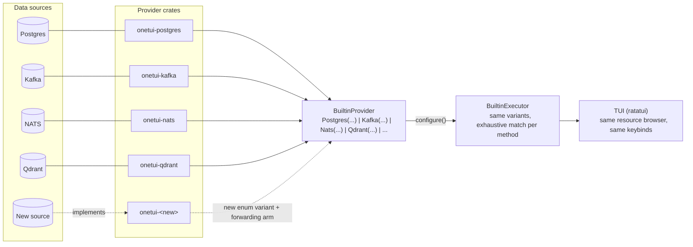
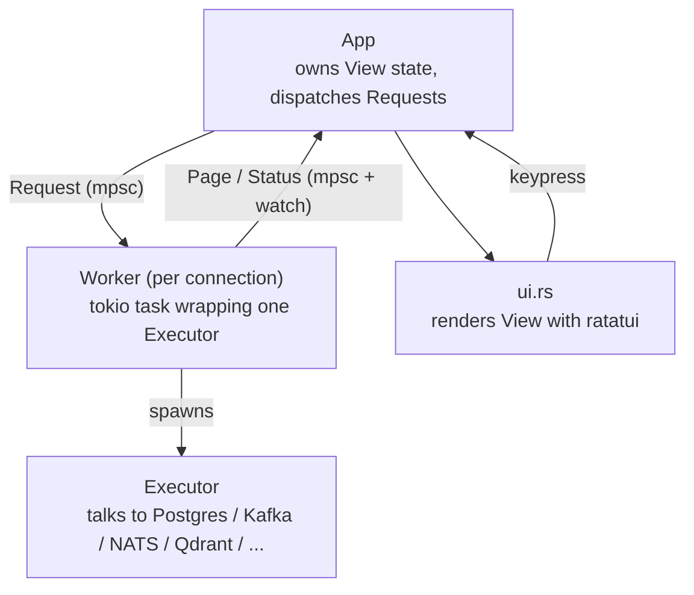

tl;dr Code is at [github.com/syndbg/onetui](https://github.com/syndbg/onetui). If the idea of one consistent TUI across your databases and queues sounds useful to you too, I'd like to hear about it.

---

Over the years I've used DBeaver, DataGrip, psql, and whatever Kafka CLI happened to be the flavor of the month. Each one does its job, more or less. None of them feel like the same tool. Keybinds differ. Panels differ. Some support the data source I need that day, some don't. Some barely work.

What's missing across all of them isn't features or polish. It's one interaction model I can get used to and use consistently, whether I'm looking at Postgres rows or a Kafka topic. And why not a few more data sources too?

## Standing on prior tools

OneTUI isn't a from-scratch idea and I don't want to pretend it is. It borrows on purpose: [K9s](https://k9scli.io/)'s resource and navigation model and adds a thin TUI layer over the raw protocol. DBeaver and DataGrip's breadth of data source support (minus the inconsistency), the Kafka/Redpanda support and expectations for various schema sources and decoding - Buf, Proto, Avro, Schema Registry. The point isn't novelty. It's picking the parts that already proved themselves and dropping the parts that didn't, inside one consistent shell.

Most useful tools work this way. Few are invented whole.

## K9s, and why it's the reference point

I admire K9s for lasting this long as a consistent tool. It has rough edges (looking at you slow timeouts when starting a new session), one set of keybinds, one mental model for every Kubernetes resource. People don't just tolerate K9s, they reach for it first. That's where I wish to get.

## The idea: OneTUI

My  goal is not to sound like the XKCD comic about standards and develop *one more tool* to solve all problems before the next one comes and tries to do the same. :D

With the bold claim "OneTUI is one terminal UI for every database, message queue, or data source you connect to. The goal is consistent resources, consistent keybinds, and a consistent interaction model, no matter which data source is on the other end."

Today that's Postgres, Kafka, NATS, and Qdrant, each with a working provider:

- **Postgres**: browse tables, inspect a row field by field, run a native query above the results.
- **Kafka**: browse topics, follow live records, decode Protobuf and Avro payloads against a schema registry automatically.
- **NATS**: browse subjects and follow live messages, same resource model as Kafka.
- **Qdrant**: browse collections and points, and inspect cluster consensus state through the same resource browser used for a Postgres table.

None of these get a separate UI, all are integrated in the same consistent TUI. 
They all sit behind the same keybinds, the same panel layout, the same way of drilling from a resource list into a single item. That's the entire goal: the tool underneath can be anything, as long as what you see and press stays the same.

Right now, that consistency is easiest to hold onto in read-only mode. So that's where OneTUI starts.

## Why read-only first

Write support raises the stakes immediately: wrong target, wrong environment, data loss. None of that is worth risking before the UI and the connection model have proven themselves. Read-only keeps the scope small on purpose. It's a starting constraint, not a missing feature. Once the core model is solid, write support has a foundation to build on instead of a rushed one to patch.

**One of my immediate next goals is, unless there's my personal interest of supporting ScyllaDB/Cassandra first, to add auto-complete for the editor and that'll be a prerequisite for writing.**

## Tech and architecture

OneTUI is written in Rust, using [ratatui](https://ratatui.rs/) for the terminal UI.

The Rust pick has two reasons. Personally, I want to learn something new. Been writing Go for 12 years, so it's enough for me to look at a different language for a while. No need for me to tell you why Rust over Go, etc.

Rust, Ratatui, Tokio, plus all the necessary dependencies to make a data source connection work.

While I am quite proficient with Go, I am writing production Rust code outside of OneTUI too. 
I am far from calling myself proficient at the same level and that's why I use LLMs to help write the Rust.

Language-aside, the code is always human reviewed. Guardrails this, guard rails that, it's human reviewed. No skipping that part.
I carry my expertise using all these databases and message queues too.

### Adding a data source

Every data source implements the same two traits: `Provider` describes it (connection fields, which resources it exposes, whether it supports live following or native queries) and builds a configured `Executor`; `Executor` does the work (`check`, `fetch_page`, `status`, and capability-gated `follow_page` / `query_page` for sources that support them). The TUI never talks to Postgres or Kafka directly. It talks to `Executor`, always the same way.

This isn't a dynamic plugin system, by design. OneTUI uses static enum dispatch: `BuiltinProvider` and `BuiltinExecutor` enums, one variant per data source, matched exhaustively. No `Box<dyn Provider>`, no `async-trait`, no boxed futures at that seam, just native `impl Future` returns the compiler can check and inline. The tradeoff is explicit: a new source needs a new crate, a new enum variant, a forwarding arm in the match, and a catalog entry, then a rebuild. What you get back is a compile error the moment dispatch is incomplete, instead of a runtime surprise from a source nobody finished wiring up.

Adding a source means writing a new crate against `Provider`/`Executor`, then wiring one enum variant into the catalog: no changes to the TUI, no changes to the other providers' code. That's the part of the architecture the whole premise leans on.

### How the TUI is put together

The render loop never blocks on network calls. Each connection gets a `Worker` running its `Executor` on its own async task; the TUI thread only exchanges messages with it.

A `Request` goes out, a `Page` or a `ConnectionStatus` comes back on a channel, the view updates, ratatui redraws. Same loop regardless of which provider is on the other end, which is what keeps the keybinds and panel behavior identical across every data source.

### A TUI still needs personality

Consistency doesn't mean the tool has to look the same for everyone. OneTUI ships ten built-in color themes you can switch between, so the shell that's identical across every data source doesn't have to be visually dull across every terminal.

Plus Solarized, Nord, Dracula, Tokyo Night, One Dark, Rosé Pine, Monokai, and Flexoki.

Custom keybinds aren't there yet. The current set is fixed. But the architecture makes adding remapping straightforward, there are a few reasonable ways to do it, and I haven't had to pick one yet because nobody's asked. If enough people want it, it gets prioritized.

Where this gets fun to use: Kafka messages encoded in Protobuf or Avro, decoded live against a schema registry, with the schema auto-detected. No manual schema picking, no separate deserializer bolted on the side.

Auto-detection works well. Rendering still has minor rough edges I haven't polished out yet, worth saying plainly rather than glossing over. But this is the part that turns the "consistent TUI across data sources" pitch into something I can point at and say: it already works.

Qdrant's consensus state, in the same resource browser used for a Postgres table:

## Where it stands, and where it's going

OneTUI is publicly released as I write this blog post. 
This is not a big deal, it's just another tool, I only want to make something useful.

I've been sharing it with a few colleagues and friends. The feedback is positive.
Any feedback, GitHub issue or time spent using it is greatly appreciated. 

Now where it is going? The architecture leaves room to grow: new data sources, new resource types. In practice that means almost any data source is fair game, whatever exposes rows, records, or resources through some protocol fits the same provider shape. As I mentioned earlier ScyllaDB/Cassandra makes sense for the sake of supporting the most popular protocols.

Still. the shared goal across all of it isn't the count of features. It's a TUI people actually want to reach for, the same reason K9s wins over raw `kubectl` for a lot of people day to day: not more power, just less friction to use the functionality that's already there.

Will OneTUI replace psql and active tools used to query and modify data sourecs? Not today. psql has decades of trust and a query editor good developers already know from muscle memory. But that gap is closable: real autocomplete against the live schema, a proper multi-line editor instead of a single input line, history that's searchable instead of scrollback. None of that requires reinventing the protocol underneath, it's interface work. I think a TUI can beat a REPL at its own game if it takes the editing experience as seriously as the data browsing.

Code is at [github.com/syndbg/onetui](https://github.com/syndbg/onetui). If the idea of one consistent TUI across your databases and queues sounds useful to you too, I'd like to hear about it.
