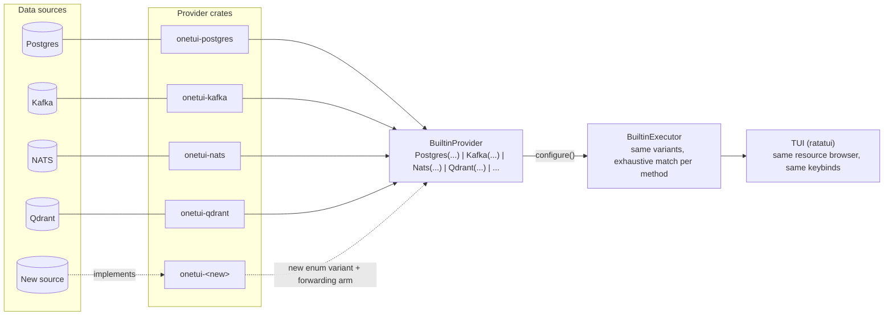
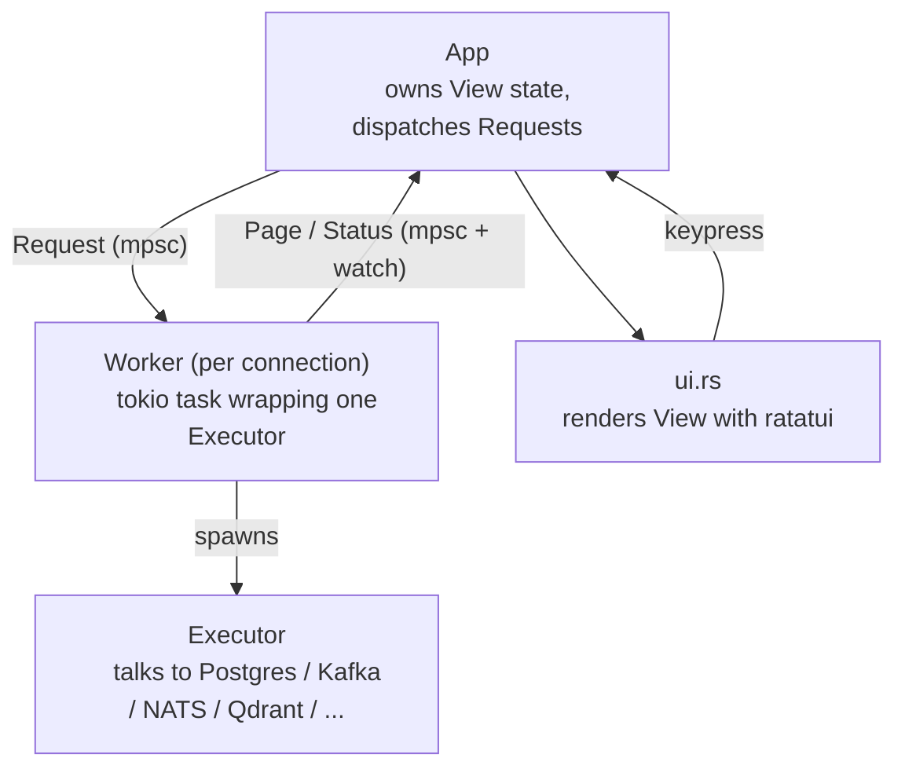

tl;dr Code is at [github.com/syndbg/onetui](https://github.com/syndbg/onetui). If the idea of one consistent TUI across your databases and queues sounds useful to you too, I'd like to hear about it.

---

Over the years I've used DBeaver, DataGrip, psql, and whatever Kafka CLI happened to be the flavor of the month. Each one does its job, more or less. None of them feel like the same tool. Keybinds differ. Panels differ. Some support the data source I need that day, some don't. Some barely work.

What's missing across all of them isn't features or polish. It's one interaction model I can get used to and use consistently, whether I'm looking at Postgres rows or a Kafka topic. And why not a few more data sources too?

## Standing on prior tools

OneTUI borrows K9s's resource navigation model and aims for the breadth of database support I use in DBeaver and DataGrip. For Kafka, that includes the schema and decoding workflows I expect from Redpanda, Buf, Protobuf, Avro, and Schema Registry. I am not trying to invent a new protocol. I want one interface around the ones I already use.

## K9s, and why it's the reference point

I admire K9s for lasting this long as a consistent tool. It has rough edges (looking at you slow timeouts when starting a new session), one set of keybinds, one mental model for every Kubernetes resource. People don't just tolerate K9s, they reach for it first. That's where I wish to get.

## The idea: OneTUI

My  goal is not to sound like the XKCD comic about standards and develop *one more tool* to solve all problems before the next one comes and tries to do the same. :D

With the bold claim "OneTUI is one terminal UI for every database, message queue, or data source you connect to. The goal is consistent resources, consistent keybinds, and a consistent interaction model, no matter which data source is on the other end."

Today that's Postgres, Kafka, NATS, and Qdrant, each with a working provider:

- **Postgres**: browse tables, inspect a row field by field, run a native query above the results.
- **Kafka**: browse topics, follow live records, decode Protobuf and Avro payloads against a schema registry automatically.
- **NATS**: browse subjects and follow live messages, same resource model as Kafka.
- **Qdrant**: browse collections and points, and inspect cluster consensus state through the same resource browser used for a Postgres table.

None of these get a separate UI, all are integrated in the same consistent TUI. 
They all sit behind the same keybinds, the same panel layout, the same way of drilling from a resource list into a single item. That's the entire goal: the tool underneath can be anything, as long as what you see and press stays the same.

At the 0.1.0 release, OneTUI was read-only. That kept the first release focused on navigation and the shared interaction model.

## Why 0.1.0 started read-only

At 0.1.0, I kept the interface read-only while I tested navigation and the connection model. Writes can change real data, so I wanted that shared workflow to feel solid first. Version 0.2.0 added provider-specific writes with a confirmation step.

At 0.1.0, I expected autocomplete to come before writes. Version 0.2.0 took a different route: it added provider-specific write operations, a multi-line editor, and query history. Autocomplete is still open work. [Read the 0.2.0 notes](/posts/2026-09-28-onetui-0-2-0/).

## Tech and architecture

OneTUI is written in Rust, using [ratatui](https://ratatui.rs/) for the terminal UI.

I chose Rust partly because I wanted to learn a new language after twelve years of writing Go. OneTUI uses Ratatui for the interface and Tokio for asynchronous work. I also use LLMs to help with Rust, where I have less experience than I do with Go and the data systems OneTUI connects to. I review the generated code before it stays.

### Adding a data source

Every data source implements the same two traits: `Provider` describes it (connection fields, which resources it exposes, whether it supports live following or native queries) and builds a configured `Executor`; `Executor` does the work (`check`, `fetch_page`, `status`, and capability-gated `follow_page` / `query_page` for sources that support them). The TUI never talks to Postgres or Kafka directly. It talks to `Executor`, always the same way.

This isn't a dynamic plugin system, by design. OneTUI uses static enum dispatch: `BuiltinProvider` and `BuiltinExecutor` enums, one variant per data source, matched exhaustively. No `Box<dyn Provider>`, no `async-trait`, no boxed futures at that seam, just native `impl Future` returns the compiler can check and inline. The tradeoff is explicit: a new source needs a new crate, a new enum variant, a forwarding arm in the match, and a catalog entry, then a rebuild. What you get back is a compile error the moment dispatch is incomplete, instead of a runtime surprise from a source nobody finished wiring up.

```mermaid
flowchart LR
    subgraph Sources["Data sources"]
        PG[(Postgres)]
        KF[(Kafka)]
        NT[(NATS)]
        QD[(Qdrant)]
        NEW[("New source")]
    end

    subgraph Crates["Provider crates"]
        PGC[onetui-postgres]
        KFC[onetui-kafka]
        NTC[onetui-nats]
        QDC[onetui-qdrant]
        NEWC["onetui-&lt;new&gt;"]
    end

    PG --- PGC
    KF --- KFC
    NT --- NTC
    QD --- QDC
    NEW -.implements.-> NEWC

    PGC --> BP["BuiltinProvider
    Postgres(...) | Kafka(...) | Nats(...) | Qdrant(...) | ..."]
    KFC --> BP
    NTC --> BP
    QDC --> BP
    NEWC -.->|"new enum variant + forwarding arm"| BP

    BP -- "configure()" --> BE["BuiltinExecutor
    same variants, exhaustive match per method"]

    BE --> TUI["TUI (ratatui)
    same resource browser, same keybinds"]
```

Adding a source means writing a new crate against `Provider`/`Executor`, then wiring one enum variant into the catalog: no changes to the TUI, no changes to the other providers' code. That's the part of the architecture the whole premise leans on.

### How the TUI is put together

The render loop never blocks on network calls. Each connection gets a `Worker` running its `Executor` on its own async task; the TUI thread only exchanges messages with it.

```mermaid
flowchart TB
    App["App
    owns View state, dispatches Requests"]
    Worker["Worker (per connection)
    tokio task wrapping one Executor"]
    Exec["Executor
    talks to Postgres / Kafka / NATS / Qdrant / ..."]
    UI["ui.rs
    renders View with ratatui"]

    App -- "Request (mpsc)" --> Worker
    Worker -- "spawns" --> Exec
    Worker -- "Page / Status (mpsc + watch)" --> App
    App --> UI
    UI -- "keypress" --> App
```

A `Request` goes out, a `Page` or a `ConnectionStatus` comes back on a channel, the view updates, ratatui redraws. Same loop regardless of which provider is on the other end, which is what keeps the keybinds and panel behavior identical across every data source.

### A TUI still needs personality

Consistency doesn't mean the tool has to look the same for everyone. OneTUI ships ten built-in color themes you can switch between, so the shell that's identical across every data source doesn't have to be visually dull across every terminal.

Plus Solarized, Nord, Dracula, Tokyo Night, One Dark, Rosé Pine, Monokai, and Flexoki.

Custom keybinds aren't there yet. The current set is fixed. But the architecture makes adding remapping straightforward, there are a few reasonable ways to do it, and I haven't had to pick one yet because nobody's asked. If enough people want it, it gets prioritized.

Where this gets fun to use: Kafka messages encoded in Protobuf or Avro, decoded live against a schema registry, with the schema auto-detected. No manual schema picking, no separate deserializer bolted on the side.

Auto-detection works well. Rendering still has minor rough edges I haven't polished out yet, worth saying plainly rather than glossing over. But this is the part that turns the "consistent TUI across data sources" pitch into something I can point at and say: it already works.

Qdrant's consensus state, in the same resource browser used for a Postgres table:

## Where it stands, and where it's going

OneTUI 0.1.0 is released. I want it to be useful, not to claim it replaces the tools people already trust. I have shared it with colleagues and friends, and their feedback is helping me decide what to build next.

Now where it is going? The architecture leaves room to grow: new data sources, new resource types. In practice that means almost any data source is fair game, whatever exposes rows, records, or resources through some protocol fits the same provider shape. As I mentioned earlier ScyllaDB/Cassandra makes sense for the sake of supporting the most popular protocols.

Still. the shared goal across all of it isn't the count of features. It's a TUI people actually want to reach for, the same reason K9s wins over raw `kubectl` for a lot of people day to day: not more power, just less friction to use the functionality that's already there.

I do not expect OneTUI 0.1.0 to replace `psql`. The protocol is not the gap. The editor is. A TUI needs multiline editing, searchable history, and schema-aware completion before I would reach for it over a mature REPL. The first two arrived in 0.2.0; autocomplete remains unfinished.

The code is at [github.com/syndbg/onetui](https://github.com/syndbg/onetui).
